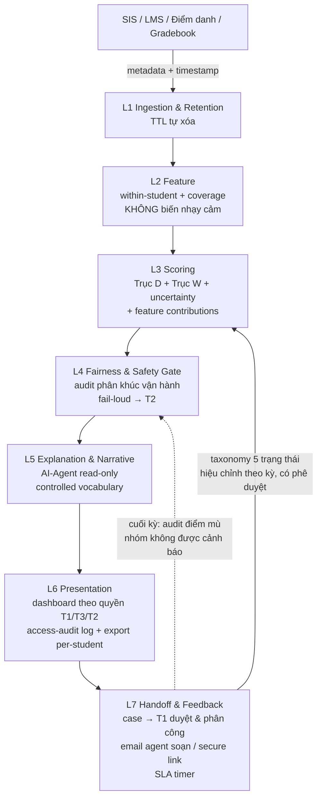

# BỔ SUNG BRIEF — D.6 REVISED: LUỒNG LOGIC HỆ THỐNG (L1–L7)

> Tài liệu bổ sung cho `Problems_Brief.md`, thay thế **mục D.6 (bảng L1–L6) và D.6.1** hiện tại. Bản gốc có 4 lỗi kiến trúc: (1) L2 xóa biến nhạy cảm nhưng L4 lại đòi audit "theo nhóm" — tự mâu thuẫn; (2) L5 hứa "lý do tổng hợp" nhưng không tầng nào sinh ra lý do, và AI-Agent tuyên bố ở D.1 không xuất hiện trong kiến trúc; (3) D.6.1 bước 5 hứa feedback nhưng pipeline một chiều, không có đường quay về; (4) L6 route thẳng ca tới người phụ trách, mâu thuẫn với triết lý "lãnh đạo duyệt & phân công" của D.2.
>
> **Vị trí ghép:** thay toàn bộ mục D.6 + D.6.1 trong brief. Bảng mapping tầng cũ → mới ở cuối §1.

---

## §0 — Quyết định thiết kế nền tảng: KHÔNG có dữ liệu dân tộc / kinh tế ở bất kỳ đâu

Hệ thống **không thu thập, không lưu trữ, không suy diễn** hoàn cảnh kinh tế, dân tộc, hay các proxy trực tiếp của chúng (hộ khẩu/quê quán, diện miễn giảm học phí, học bổng chính sách, hộ nghèo/cận nghèo) — ở **mọi tầng**, kể cả tầng audit. Lý do:

1. **Ngăn phân biệt từ gốc:** dữ liệu không tồn tại thì không thể bị lạm dụng, rò rỉ, hay len vào quyết định — mức chống phân biệt mạnh nhất là hệ thống *không bao giờ biết đến* các thuộc tính này. Đây cũng là data minimization triệt để theo tinh thần Nghị định 13/2023.
2. **Đúng ràng buộc đề bài theo cách khả thi:** đề cấm cảnh báo *lệch theo* kinh tế/dân tộc — không yêu cầu *đo lường* theo kinh tế/dân tộc. Chiến lược của hệ thống là **ngăn lệch bằng thiết kế** thay vì **đo lệch bằng dữ liệu nhạy cảm**.

**Fairness không có dữ liệu nhạy cảm thì đảm bảo bằng gì?** — Ba lớp, đều kiểm chứng được:

| Lớp | Cơ chế | Vì sao chặn được bias kinh tế/dân tộc |
| :---- | :---- | :---- |
| Phòng ngừa bằng thiết kế | Chuẩn hóa **within-student** là mặc định (SV so với baseline của chính mình, không so chéo); buffer chỉ *giảm* severity, không bao giờ *tăng*; ngưỡng dùng trend/velocity thay vì mức tuyệt đối. | Kênh bias chính (SV hoàn cảnh khó có mức nền thấp hơn — điểm danh, LMS, thiết bị) bị vô hiệu vì mỗi SV chỉ được so với chính mình. SV nghèo đi làm thêm có baseline riêng của họ; hệ chỉ phản ứng khi *chính họ* thay đổi. |
| Audit theo phân khúc vận hành | Đo chênh lệch tỷ lệ cảnh báo & tỷ lệ false-alarm giữa các phân khúc **phi nhạy cảm, có sẵn trong SIS**: ngành, hệ đào tạo, khóa, cơ sở/campus, hình thức học (chính quy/VLVH). Ngưỡng ví dụ: tỷ lệ cảnh báo của một phân khúc lệch >1.5× median các phân khúc → điều tra. | Bias hạ tầng và bias cấu trúc (ngành không có LMS, campus tỉnh ít dữ liệu...) hiện ra ở đúng các phân khúc này — bắt được phần lớn disparate impact thực tế mà không cần hỏi SV thuộc dân tộc nào. Nhất quán với KPI công bằng ở E.3. |
| Audit công bằng độ phủ (coverage equity) | Theo dõi **chênh lệch coverage score** giữa các phân khúc: nhóm nào có dữ liệu mỏng hơn hệ thống phải *im lặng nhiều hơn* chứ không *đoán nhiều hơn*; đồng thời báo cáo tỷ lệ im lặng để trường bổ sung kênh dữ liệu, thay vì để một nhóm "vô hình". | Với hệ within-student, nguồn lệch còn lại chủ yếu là **lệch độ phủ dữ liệu** (ai có ít dữ liệu hơn thì được bảo vệ kém hơn). Audit trực tiếp vào kênh này thay vì suy diễn nhóm nhân khẩu. |

**Câu trả lời chuẩn cho Q&A** (khi bị hỏi "không có dữ liệu dân tộc thì sao chứng minh không lệch theo dân tộc?"):
> *"Chúng tôi chọn không đưa dữ liệu dân tộc/kinh tế vào hệ thống — kể cả để audit — vì thu thập nó tạo ra chính rủi ro phân biệt mà đề bài muốn ngăn. Thay vào đó: (1) kênh bias chính bị chặn từ thiết kế bằng chuẩn hóa within-student; (2) disparate impact được audit trên các phân khúc vận hành nơi bias hạ tầng thực sự biểu hiện; (3) chúng tôi nói thẳng giới hạn: hệ thống không tính được equalized odds theo dân tộc — và chúng tôi cho rằng đó là trade-off đúng, vì một hệ thống lưu nhãn dân tộc của từng sinh viên kèm điểm rủi ro là mối nguy lớn hơn một chỉ số không đo được."*

---

## §1 — Bảng tầng L1–L7 (thay bảng D.6 cũ)

**Nhịp chạy (cadence):** pipeline chạy **batch theo tuần** (đủ cho trend học vụ) + **trigger theo sự kiện** cho các tín hiệu cần phản ứng nhanh (vắng thi, quyết định probation, sự kiện học vụ sốc #18 nếu trục W được thông qua). Mọi bản ghi đều gắn nguồn & timestamp để tái lập được (reproducible).

| Tầng | Chức năng | Input → Output | Ràng buộc bắt buộc |
| :---- | :---- | :---- | :---- |
| **L1 Ingestion & Retention** | Thu thập metadata từ SIS, LMS, điểm danh, điểm quá trình; **chủ sở hữu chính sách lưu trữ**: thực thi TTL, tự xóa tín hiệu quá hạn (đặc biệt tín hiệu wellbeing không được escalate — cam kết ở D.3.1 được thi hành tại đây). | Nguồn vận hành → bản ghi metadata pseudonymized \+ lịch xóa. | Chỉ metadata; loại bỏ nội dung; gắn nguồn & timestamp; job xóa theo TTL chạy tự động và có log chứng minh đã xóa. |
| **L2 Feature** | Tính đặc trưng within-student (mặc định) & so cohort ẩn danh (chỉ thống kê tổng hợp); gắn coverage score cho từng feature. | Metadata → feature vector \+ coverage. | KHÔNG thu thập/suy diễn biến dân tộc, kinh tế hay proxy trực tiếp (hộ khẩu, miễn giảm, học bổng chính sách) — xem §0. Feature mới phải qua review "proxy check" trước khi vào production. |
| **L3 Scoring** | Hợp nhất đa tín hiệu → (Dropout Risk, Wellbeing Check) kèm uncertainty; xuất **feature contributions** (đóng góp của từng tín hiệu) làm nguyên liệu cho tầng giải thích. | Feature → 2 điểm \+ độ tin cậy \+ contributions. | Multi-signal bắt buộc cho trục W; calibrate ngưỡng theo chi phí false-alarm; nhận tham số hiệu chỉnh từ L7 (vòng feedback). |
| **L4 Fairness & Safety Gate** | Audit disparate impact theo **phân khúc vận hành** (ngành/hệ/khóa/campus — §0) \+ audit coverage equity; kiểm tra sức khỏe phân phối cảnh báo (đột biến số lượng bất thường). | Điểm → điểm đã qua kiểm định \+ báo cáo audit định kỳ. | Không cảnh báo khi coverage thấp. **Fail-loud, không fail-silent:** phát hiện lệch bất thường → không chặn âm thầm mà giữ output lại \+ phát cảnh báo vận hành cho T2 kèm quy trình xử lý trong 48h. Mọi lần can thiệp gate đều được log. |
| **L5 Explanation & Narrative** *(tầng mới — trái tim AI-native)* | **AI-Agent** nhận feature contributions từ L3 và sinh: (a) *lý do tổng hợp* cho từng ca bằng **controlled vocabulary** (ngôn ngữ hành vi trung tính, cấm từ lâm sàng); (b) *tóm tắt tình hình toàn chương trình* cho báo cáo T1; (c) trả lời chất vấn của người dùng về một ca ("vì sao SV này ở mức D2?") — **chỉ đọc, có nguồn**; (d) **soạn thảo email giao việc** cho T1 gửi GVCN — nội dung theo controlled vocabulary, đủ để hành động mà không cần đính kèm gì (xem §2b). | Điểm \+ contributions → lý do có cấu trúc \+ narrative theo vai trò. | Agent **read-only**: không sửa điểm, không suy diễn nguyên nhân đời tư, không đề xuất kỷ luật; mọi câu trả lời phải trích được về tín hiệu gốc (grounding — không bịa); từ vựng qua bộ lọc controlled vocabulary trước khi hiển thị; log toàn bộ prompt/response để audit. |
| **L6 Presentation** | Hiển thị theo tầng quyền (**T1/T3/T2** — bảng ở §2b, thay bảng 2 tầng của D.3.1); danh sách ưu tiên \+ lý do từ L5 \+ **mức tin cậy/coverage hiển thị công khai** trên từng ca; xuất báo cáo **per-student** cho T1 (watermark \+ log — §2b). | Narrative → dashboard theo vai trò \+ email giao việc \+ secure link. | Ẩn breakdown wellbeing với T1 (chỉ hiện gợi ý tổng hợp); TTL cho lý do; **access-audit log**: mọi lượt xem/lượt xuất hồ sơ ưu tiên đều ghi lại ai-xem-gì-lúc-nào — cơ chế chống lạm dụng danh sách (chống dùng cho kỷ luật/sàng lọc); KHÔNG có bulk-export định danh. |
| **L7 Handoff & Feedback** | Tạo **case** cho T1 duyệt & phân công (không route thẳng — xem D.6.1); theo dõi SLA; thu nhận kết quả tiếp cận theo taxonomy; **khép vòng feedback** về L3. | Cảnh báo → case được con người xử lý → tham số hiệu chỉnh cho L3. | Không hành động tự động; con người quyết định ở mọi bước; SLA timer cho ca ưu tiên cao; feedback dùng taxonomy 5 trạng thái (D.6.1), không nhị phân. |

**Mapping với bảng cũ:** L1→L1 (+retention), L2→L2 (đổi ràng buộc theo §0), L3→L3 (+contributions), L4→L4 (đổi cơ chế audit + fail-loud), **L5 là tầng mới**, L5 cũ→L6 (+access-audit), L6 cũ→L7 (+SLA, taxonomy, vòng feedback).

---

## §2 — D.6.1 REVISED: Quy trình chuyển giao con người (Handoff)

Luồng thống nhất với D.2 (lãnh đạo duyệt & phân công — hệ thống không bao giờ tự route ca tới giảng viên):

1. **Tạo case:** L7 đưa các ca vượt ngưỡng vào **hàng đợi duyệt của T1** (Ban Lãnh đạo), kèm lý do tổng hợp từ L5 và mức tin cậy/coverage.

2. **Duyệt & phân công:** T1 quyết định ca nào cần tiếp cận và **giao cho đúng người phù hợp nhất** (CVHT, giảng viên gần gũi, chuyên viên CTSV). Người được phân công chỉ nhận **brief tối giản**: mức ưu tiên + lý do ở dạng controlled vocabulary — không thấy điểm số thô, không thấy breakdown tín hiệu. Kênh giao việc mặc định là **email do agent soạn sẵn** cho T1 duyệt và gửi — GVCN không bắt buộc phải đăng nhập hệ thống (chi tiết cơ chế và phân tầng T3 ở §2b).

3. **SLA & chống nghẽn cổ chai:** ca ưu tiên cao (D3, hoặc W3 nếu trục W được thông qua) có **đồng hồ SLA**: chưa được duyệt sau 3 ngày làm việc → hệ thống nhắc lại T1; chưa được xử lý sau 5 ngày → escalate lên cấp phụ trách CTSV theo quy trình trường tự định nghĩa. Lãnh đạo bận họp không được trở thành lý do một ca khẩn nằm chờ 3 tuần.

4. **Tiếp cận:** với ca mức vừa (D1–D2), cuộc tiếp cận là **warm check-in** — hỏi thăm, đề nghị giúp đỡ; không dò hỏi chẩn đoán, không kỷ luật. Ca mức cao (D3 / vượt ngưỡng crisis) được **chuyển tuyến chuyên trách** (CTSV / tham vấn học đường); CVHT không phải điểm cuối.

5. **Ghi nhận kết quả theo taxonomy 5 trạng thái** (không nhị phân, để tránh dạy hệ thống im lặng):
   - `không liên hệ được` (≥2 lần thử) — tự nó là một tín hiệu, đẩy lại hàng đợi T1;
   - `đã hỏi thăm — ổn` (SV không cần hỗ trợ; **không** mặc định là false-alarm của model);
   - `đã hỏi thăm — hỗ trợ nhẹ` (giải đáp, kết nối tài nguyên);
   - `đã chuyển tuyến` (case chuyển bộ phận chuyên trách, theo dõi tiếp);
   - `cảnh báo sai rõ ràng` (có nguyên nhân xác đáng không liên quan — ví dụ nghỉ ốm có phép mà hệ thống không thấy) — chỉ trạng thái này mới được tính là false-alarm khi hiệu chỉnh.

6. **Khép vòng feedback (L7 → L3):** phân phối 5 trạng thái được dùng để hiệu chỉnh ngưỡng theo chu kỳ (học kỳ), có người phê duyệt — không tự động cập nhật model theo từng ca.

7. **Audit điểm mù (chống feedback-loop bias):** mỗi cuối kỳ, đối chiếu nhóm **không được cảnh báo** với outcome học vụ thực tế (rớt môn, nghỉ học, cảnh báo học vụ) — đo miss rate thật. Hệ thống chỉ học từ ca nó đã báo; bước này là cách duy nhất biết nó đang bỏ sót ai. Chỉ dùng dữ liệu học vụ có sẵn, không dữ liệu nhạy cảm.

**Nguyên tắc "human-in-the-loop" (giữ nguyên):** mọi cảnh báo là **decision support**, không phải **decision**. Con người luôn ra quyết định cuối cùng và thực hiện chăm sóc.

---

## §2b — Kênh giao việc qua email & tầng quyền T3 (GVCN)

**Nguyên tắc: email là kênh BÁO, không phải kênh CHỨA.** Giao việc qua email để GVCN không phải học/đăng nhập hệ thống mới (họ đã quá tải — đây là ràng buộc thiết kế, không phải tiện ích), nhưng dữ liệu phái sinh không bao giờ rời khỏi vòng kiểm soát dưới dạng file đính kèm.

**Cơ chế theo mức ca:**

* **Ca D1–D2 / W2 (warm check-in):** nội dung email **tự nó là brief** — tên SV + lý do controlled vocabulary + gợi ý hành động (*"em X gần đây có thay đổi nhịp học tập, nhờ thầy/cô chủ động hỏi thăm"*). **Không đính kèm gì, không điểm số, không biểu đồ.** Email này lộ ra ngoài cũng gần như vô hại — nó đọc như một lời nhờ quan tâm bình thường của khoa. Với đa số ca, đây là toàn bộ những gì GVCN cần để hành động.
* **Ca cần chi tiết (D3 / W3, kế hoạch học tập):** email + **secure link** — click vào xác thực nhẹ (SSO trường / OTP), xem brief trong hệ thống. Link **hết hạn theo vòng đời case, log lượt xem, thu hồi được** khi case đóng. Trải nghiệm với GVCN vẫn chỉ là "click một cái link".
* **Xuất báo cáo per-student (quyền T1):** lãnh đạo được xuất báo cáo chi tiết **từng SV một** khi cần làm việc trực tiếp; bản xuất ở dạng controlled vocabulary, **gắn watermark (người xuất + thời điểm)** và mỗi lần xuất ghi vào access-audit log. Không tồn tại chức năng bulk-export danh sách định danh; xuất thống kê tổng hợp không định danh (phục vụ phân bổ nguồn lực) thì không hạn chế.

**Bảng phân tầng quyền (thay bảng 2 tầng ở D.3.1):**

| Tầng | Vai trò | Được thấy gì | KHÔNG được thấy gì |
| :---- | :---- | :---- | :---- |
| T1 | Ban Lãnh đạo Khoa/Trường | Báo cáo ưu tiên toàn chương trình; lý do tổng hợp + mức tin cậy; xuất per-student có watermark + log. | Điểm rủi ro thô; breakdown chi tiết từng tín hiệu. |
| **T3** *(mới)* | GVCN / chuyên viên hỗ trợ | **Ca được phân công** (qua email + secure link, hoặc đăng nhập); phạm vi trần = lớp mình phụ trách. | **Bảng xếp hạng rủi ro cả lớp** (kể cả lớp mình); ca không được giao; điểm số và breakdown tín hiệu. |
| T2 | Quản trị hệ thống / nhóm phát triển | Dữ liệu giả danh hóa để huấn luyện & audit; nhật ký vận hành. | Danh tính thật gắn với điểm rủi ro. |

**Phân định dữ liệu gốc vs dữ liệu phái sinh** (trả lời câu "GVCN vốn xem được dữ liệu SV lớp mình rồi thì hệ thống chặn gì?"):

* **Dữ liệu gốc** (điểm, điểm danh, tiến độ học tập) — GVCN có quyền tra cứu theo quy chế trường, **tồn tại trước và ngoài hệ thống này**; hệ thống không cấp thêm và không thu hẹp quyền đó. GVCN muốn tìm hiểu kỹ hơn về SV được giao → tra hệ thống trường như vẫn làm.
* **Dữ liệu phái sinh** (điểm rủi ro, xếp hạng ưu tiên, cờ wellbeing) — do hệ thống này *tạo ra*, và là thứ duy nhất có khả năng **dán nhãn**. Đây mới là đối tượng của phân tầng T1/T3/T2. Hệ thống không bao giờ đưa bảng xếp hạng rủi ro cả lớp cho GVCN — vì như thế là tái tạo "danh sách theo dõi phát tán tới từng giảng viên" mà D.2 đã chủ đích tránh, và biến GVCN từ người chăm sóc thành người giám sát.

**Về nỗi lo "GVCN quá tải mà phải tự lên hệ thống tra cứu":** quy trình được thiết kế để việc tra cứu là **quyền chọn, không phải nghĩa vụ**. Email brief phải tự đủ để hành động (với warm check-in, biết tên + lý do trung tính là đủ để mở lời). Nếu một ca đòi hỏi GVCN phải đọc nhiều tài liệu mới xử lý được, thì đó là dấu hiệu ca đó thuộc diện **chuyển tuyến chuyên trách** (D3/W3) — chứ không phải lý do đè thêm việc đọc lên GVCN.

---

## §3 — Sơ đồ luồng (tham khảo cho dev)

---

## §4 — Checklist chất vấn mà bản revised trả lời được

| Câu hỏi giám khảo | Trả lời nằm ở |
| :---- | :---- |
| "Không có dữ liệu dân tộc thì chứng minh fairness kiểu gì?" | §0 — ba lớp: thiết kế within-student, audit phân khúc vận hành, coverage equity + câu Q&A mẫu |
| "Lý do hiển thị cho lãnh đạo do cái gì sinh ra? Có bịa không?" | L5 — agent read-only, grounding về tín hiệu gốc, controlled vocabulary, log đầy đủ |
| "AI-native ở đâu trong kiến trúc này?" | L5 là tầng AI-Agent trung tâm; L1–L4 là hệ thần kinh cảm nhận, L5 là tầng ngôn ngữ |
| "Lãnh đạo không xử lý thì ca khẩn nằm đâu?" | §2 bước 3 — SLA timer + escalation |
| "Hệ thống có tự dạy mình im lặng không?" | §2 bước 5 (taxonomy, chỉ 1/5 trạng thái là false-alarm) + bước 7 (audit điểm mù) |
| "Ai đảm bảo danh sách không bị dùng để kỷ luật/sàng lọc?" | L6 access-audit log + brief tối giản cho người thực thi + purpose limitation (D.3.1) |
| "Dữ liệu wellbeing bị xóa lúc nào, ai chịu trách nhiệm?" | L1 — chủ sở hữu retention, job xóa có log |
| "GVCN quá tải, có phải học/dùng thêm hệ thống mới không?" | §2b — email do agent soạn là brief tự đủ để hành động; đăng nhập chỉ là tùy chọn |
| "Email giao việc bị forward/lộ thì sao?" | §2b — mail không chứa report: ca thường chỉ có lý do trung tính (lộ cũng vô hại), ca chi tiết dùng secure link hết hạn + log |
| "GVCN vốn xem được điểm SV lớp mình trên hệ thống trường, vậy phân quyền này chặn gì?" | §2b — phân định dữ liệu gốc (quyền sẵn có, không đụng) vs dữ liệu phái sinh (điểm rủi ro/xếp hạng — chỉ thấy ca được giao, không thấy xếp hạng cả lớp) |
