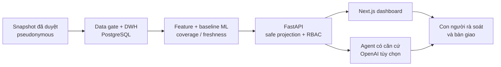

# Silent Shield — VAIC 2026 (ABG)

> Nền tảng hỗ trợ phát hiện sớm những thay đổi học tập cần được quan tâm, giúp
> Ban Lãnh đạo ưu tiên rà soát và bàn giao đúng trường hợp cho người hỗ trợ.

Silent Shield phân tích **biến động điểm theo học kỳ** và **điểm danh theo thời
gian** từ dữ liệu đã được phê duyệt, tối thiểu hóa và định danh giả. Hệ thống tạo
**tín hiệu cần rà soát** kèm bằng chứng, độ phủ và độ mới của dữ liệu; con người
luôn là bên quyết định phê duyệt, loại bỏ, hoãn hoặc bàn giao case.

Silent Shield không chẩn đoán, không gắn nhãn “sinh viên có nguy cơ”, không giám
sát nội dung riêng tư và không tự động đưa ra quyết định bất lợi cho sinh viên.

## Truy cập bản demo

| Thành phần | Đường dẫn | Trạng thái kiểm tra ngày 19/07/2026 |
|:--|:--|:--|
| Ứng dụng web | [abg-team.vercel.app](https://abg-team.vercel.app) | Hoạt động; chuyển tới trang đăng nhập |
| Health qua HTTPS proxy | [abg-team.vercel.app/health](https://abg-team.vercel.app/health) | `200`, API và database sẵn sàng |
| Live API | `http://52.74.255.88:8000` | Hoạt động; endpoint nghiệp vụ yêu cầu đăng nhập |

Tài khoản demo gồm `quanly`, `gvcn` và `demo`; mật khẩu chỉ do người vận hành
cung cấp, không được lưu trong repository.

## Bài toán và cách tiếp cận

Thông tin học tập thường nằm ở nhiều nguồn và chỉ được chú ý khi vấn đề đã rõ
rệt. Silent Shield tạo một lớp hỗ trợ rà soát sớm cho bối cảnh đại học:

1. Nhận snapshot đã qua data gate về quyền sử dụng, provenance, schema, hash,
   chất lượng và PII.
2. Tính các đặc trưng thay đổi theo thời gian, coverage và freshness bằng pipeline
   xác định, có version.
3. Xếp **mức độ ưu tiên rà soát** nội bộ và chỉ công khai dải ưu tiên, yếu tố đóng
   góp cùng giới hạn dữ liệu — không lộ raw score hoặc trọng số mô hình.
4. Cho Ban Lãnh đạo xem danh sách, chi tiết và giải thích có căn cứ; dữ liệu thiếu
   hoặc cũ được trả về dưới dạng `insufficient_data` thay vì suy đoán.
5. Chỉ bàn giao case cho GVCN/cố vấn sau khi con người phê duyệt và hệ thống xác
   nhận mapping `advisor_ref` hợp lệ.

## Chức năng chính

| Nhóm | Khả năng hiện có |
|:--|:--|
| Dữ liệu và ML | Import snapshot có kiểm soát; baseline điểm học kỳ + điểm danh; kết quả tái lập với `dataset_version`, `model_version`, coverage và freshness |
| Dashboard rà soát | Danh sách ưu tiên, chi tiết case, yếu tố đóng góp, giới hạn dữ liệu và tác động của ngưỡng |
| Quy trình chăm sóc | `New Signal` → review → phê duyệt/loại/hoãn → bàn giao → theo dõi/hoàn tất; mọi chuyển trạng thái có kiểm soát |
| Xác thực và phân quyền | Cookie session phía server; hai vai trò `ban_quan_ly` và `gvcn`; giới hạn theo tổ chức/cố vấn và ghi access audit tối thiểu |
| Agent có căn cứ | Giải thích theo từng case và Global Agent backend với capability allowlist; chỉ đọc dữ liệu an toàn do server dựng, không chấm điểm hoặc đổi trạng thái |
| Báo cáo tuần | Workflow snapshot/delta, báo cáo và briefing theo vai trò, receipt đã xem/xác nhận và export có giới hạn |
| Fairness và báo động giả | Panel ngưỡng/impact; fairness chỉ công bố khi có nhóm audit, ground truth, mẫu số và cỡ mẫu hợp lệ |
| Bản nháp bàn giao | Gom case theo cố vấn và tạo bản nháp trung lập; chỉ Copy/`mailto:`, không có SMTP hoặc auto-send |

## Ranh giới an toàn

- Chỉ dùng artifact đã được phê duyệt và định danh giả; không đưa họ tên, MSSV,
  email, số điện thoại, secret hoặc dữ liệu thô vào public API, Agent hay evidence.
- Không thu thập chat, email, camera, micro, mạng xã hội hoặc nội dung riêng tư.
- Không dùng thuộc tính fairness để chấm điểm hoặc giải thích một cá nhân.
- Không gọi thiếu dữ liệu là “ổn định”; nhánh không đủ căn cứ phải fail closed.
- Agent/LLM không tính hoặc sửa mức ưu tiên, không đoán nguyên nhân, không chẩn
  đoán và không gọi hành động chuyển trạng thái/gửi liên hệ.
- UI dùng ngôn ngữ trung lập và không dùng màu sắc làm tín hiệu duy nhất.

Chi tiết xem [PRD](docs/02-product/04-prd.md),
[Ethics](docs/02-product/05-ethics.md) và
[Process](docs/02-product/03-process.md).

## Kiến trúc tổng quan



Luồng tính toán và workflow nghiệp vụ tách khỏi LLM. Frontend không gọi model
provider trực tiếp và không tự tạo mức ưu tiên khi API thiếu dữ liệu.

### Công nghệ

- **Frontend:** Next.js 15, React 19, TypeScript, Tailwind CSS.
- **Backend:** FastAPI, Pydantic, SQLAlchemy, Alembic.
- **Dữ liệu:** PostgreSQL 16; snapshot/import có hash, provenance và version.
- **AI:** adapter OpenAI Responses API phía backend, `store=false`; không fallback
  tự động sang provider khác.
- **Kiểm thử:** Pytest, Ruff, Node test runner và Playwright.

## Dữ liệu demo đã duyệt

Đường MVP hiện dùng bundle liên kết cùng namespace gồm:

- 460 `student_ref` định danh giả với dữ liệu điểm theo học kỳ;
- 7.360 sự kiện điểm danh, 16 sự kiện cho mỗi sinh viên;
- 460 snapshot ML và 1.840 dòng tổng hợp điểm danh theo tuần sau bootstrap.

Đây là gói dữ liệu MVP được allowlist để chứng minh pipeline; không phải bằng
chứng rằng hệ thống đã được kiểm định hiệu quả trên dữ liệu sinh viên thật hoặc
đã tích hợp SIS production. Xem [data/README.md](data/README.md) và
[bằng chứng bootstrap D460](docs/03-project/22-d460-local-bootstrap-evidence.md).

## Chạy local

### Yêu cầu

- Docker có Docker Compose;
- Python 3.9 trở lên;
- Node.js và npm.

### 1. Cấu hình và cài dependency

```powershell
Copy-Item .env.example .env
docker compose up -d db

python -m pip install -e ".\backend[dev]"
npm ci --prefix frontend
```

Không commit `.env`. `OPENAI_API_KEY` là tùy chọn; khi không có key, chức năng
LLM phải trả trạng thái không sẵn sàng nhưng dashboard và workflow chăm sóc vẫn
hoạt động.

### 2. Nạp dữ liệu và tạo tài khoản local

```powershell
# Chỉ dùng mật khẩu local; không dùng hoặc commit secret production.
$env:AUTH_SEED_PASSWORD = "<local-demo-password>"

python .\scripts\bootstrap_d460.py
```

Script idempotent sẽ migrate database, import semester + attendance, tạo tài
khoản demo khi có `AUTH_SEED_PASSWORD`, materialize 460 snapshot ML và roll up
attendance theo tuần.

### 3. Khởi động ứng dụng

Mở hai terminal từ thư mục gốc:

```powershell
# Terminal 1
python -m uvicorn app.main:app --app-dir backend --reload

# Terminal 2
npm run dev --prefix frontend
```

Truy cập `http://localhost:3000`; API health tại `http://localhost:8000/health`
và OpenAPI tại `http://localhost:8000/docs`.

## Kiểm tra

```powershell
# Vòng lặp nhanh: rule wiring + lint backend/frontend
.\scripts\verify.ps1 -Quick

# Test backend/frontend + production build
.\scripts\verify.ps1

# Thêm PostgreSQL/FastAPI/Next.js system test
.\scripts\verify.ps1 -System

git diff --check
git status --short
```

Full verify mặc định loại test `slow` và `eval`; vì vậy không chứng minh live
OpenAI evaluation. Release gate online có hướng dẫn riêng trong
[deploy runbook](docs/04-engineering/06-deploy-runbook.md).

## Cấu trúc repository

```text
backend/     FastAPI, contracts, data/ML pipeline, Agent và migrations
frontend/    Next.js dashboard theo vai trò
data/        Artifact demo đã duyệt và lane eval tách biệt
deploy/      Deployment helpers
docs/        Requirements, product, project và engineering docs
scripts/     Bootstrap và verify
tests/       System/release tests
.ai-log/     Nhật ký cộng tác AI đã redaction
```

`reference-Learning-Analytics-AI/` chỉ là tài liệu tham khảo local được gitignore;
không phải source code hoặc requirement của Silent Shield.

## Giới hạn hiện tại

- Danh sách `GET /review-cases` chỉ trả case vượt ngưỡng ưu tiên rà soát (thường
  vài chục), không phải toàn bộ 460 sinh viên đã import.
- Fairness trả `insufficient_data` vì chưa có thuộc tính nhóm audit được phê
  duyệt, ground truth và cỡ mẫu đủ; dự án không tạo dữ liệu giả để công bố metric.
- Giải thích LLM trên Live trả `unavailable` nếu chưa cấu hình `OPENAI_API_KEY`;
  không có fallback tự động và không ảnh hưởng luồng rà soát của con người.
- Care case chính đã lưu bền vững trong PostgreSQL; repository báo cáo/case tuần
  vẫn dùng state trong process ở MVP. EventBridge/worker production vẫn cần được
  triển khai và vận hành thủ công theo runbook.
- Auth/RBAC server-side đã có cho demo, nhưng chưa phải tích hợp SSO, quản trị danh
  tính và retention/deletion automation cấp production.
- Bản nháp liên hệ không tự gửi. Forecasting/hybrid, LMS/RAG, wellbeing, OCR/TTS,
  adaptive tutor và career matching nằm ngoài phạm vi MVP.
- Dự án chỉ chứng minh prototype hỗ trợ rà soát; không tuyên bố dự đoán chắc chắn
  việc bỏ học, chẩn đoán tâm lý hoặc đã làm giảm tỷ lệ bỏ học thực tế.

## Tài liệu chính

| Tài liệu | Nội dung |
|:--|:--|
| [RULES.md](RULES.md) | Ranh giới sản phẩm, team rules và Definition of Done |
| [AGENTS.md](AGENTS.md) | Quy trình làm việc bắt buộc cho AI agent |
| [Mục lục docs](docs/README.md) | Điểm vào toàn bộ tài liệu dự án |
| [PRD MVP](docs/02-product/04-prd.md) | Mục tiêu, người dùng, FR và acceptance |
| [Traceability](docs/01-requirements/03-traceability.md) | Ánh xạ Problems Brief sang sản phẩm |
| [Kiến trúc hệ thống](docs/04-engineering/05-system-architecture.md) | Luồng dữ liệu, case, Agent và trust boundary |
| [EPU integration contract](docs/04-engineering/04-epu-data-integration-contract.md) | Data gate, schema và provenance |
| [Sprint](docs/03-project/03-sprint.md) | Task, owner, dependency và evidence |
| [Release evidence](docs/03-project/07-release-evidence.md) | Bằng chứng smoke/acceptance và rollback |

## Nhóm ABG

| Thành viên | Vai trò chính |
|:--|:--|
| Hoàng | Product/contract, backend, deploy và release evidence |
| Khánh Duy | Frontend integration và UI |
| Nguyễn Trường Giang | Data/ML và model |
| Thu Trang | Agent, guardrails và release submission |
| Trần Hạ Giang | UAT và nội dung trình bày |
| Văn Hải | QA, video và submission |

Phân công và trạng thái task chính thức luôn theo [Sprint](docs/03-project/03-sprint.md).
