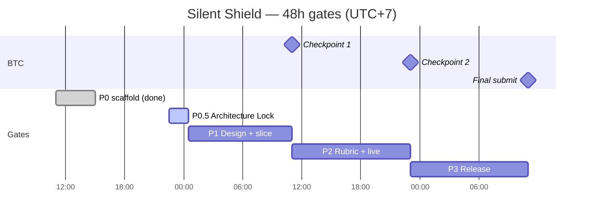

# Sprint — Silent Shield (17–19/7/2026)

> **Format học từ:** `reference-Learning-Analytics-AI/docs/07-Sprint-Planning` (SprintPlanning + Sprint1–4): board có Owner/Deadline/Depends/Done when; mô tả task theo từng lane; gate gắn mốc BTC.
> **Không lấy:** RAG, Academic Tree, CLO/PLO, dữ liệu thật, UI “dropout risk”.
> **Nguồn chuẩn thời hạn:** [01-vaic-rules.md](../01-requirements/01-vaic-rules.md) · Phạm vi: [PRD](../02-product/04-prd.md) · Rules: [RULES.md](../../RULES.md)

**Đồng hồ (UTC+7):** giờ “hiện tại” khi lập board ≈ **22:30 T6 17/7**. P0 scaffold đã xong; gate tiếp theo là **P0.5 Architecture Lock** (không làm lại P0).

**Tên trên board:** Owner/Reviewer ghi tên thành viên. Phân biệt hai Giang: **Giang** = Nguyễn Trường Giang (FE); **giang** = Trần Hạ Giang (BA/product).

| Tên trên board | Thành viên đầy đủ | Task ID prefix |
|:---------------|:------------------|:--------------:|
| Hoàng | Hoàng | H |
| Khánh Duy | Bùi Khánh Duy | M |
| Giang | Nguyễn Trường Giang | G |
| Thu Trang | Phan Thu Trang | T |
| giang | Trần Hạ Giang | A |
| Văn Hải | Đậu Văn Hải | V |

---

## 1. Cổng BTC và gate nội bộ

| Cổng BTC | Deadline | Deliverable | Gate nội bộ khớp |
|:---------|:--------:|:------------|:-----------------|
| Bắt đầu sprint | **11:00 T6 17/7** | Chọn đề, bắt đầu build | P0 start |
| **Checkpoint 1** | **11:00 T7 18/7** | Tên dự án, track, mô tả ngắn, hướng tiếp cận | Kết thúc **P1** (docs/design + hướng đã khóa) |
| **Checkpoint 2** | **23:00 T7 18/7** | Live URL + GitHub **public** | Kết thúc **P2** |
| **Đóng cổng nộp** | **11:00 CN 19/7** | Slide, video ≤5 phút, GitHub, Live URL, mô tả, AI log | Kết thúc **P3** |
| Demo Day (nếu Top 10) | **15:30 CN 19/7** | Pitch 4′ + Q&A 2′ | Sau nộp; rehearsal trong P3 |

### Bốn gate (+ P0.5)

| Gate | Wall clock | Focus | Exit criteria |
|:-----|:-----------|:------|:--------------|
| **P0** | 11:00–~15:00 T6 17/7 | Scaffold | `/health`, synthetic CSV, FE shell — **DONE** |
| **P0.5** | **22:30 T6 → 00:30 T7** (~2h) | Architecture Lock | Contract/schema, GT/threshold, state machine, board, giang PRD sign-off |
| **P1** | **00:30 → 11:00 T7** | Docs còn lại + bắt đầu vertical slice | Hướng tiếp cận + thuật ngữ khóa trước CP1; fixture public sẵn cho Giang/Thu Trang |
| **P2** | **11:00 → 23:00 T7** | Rubric + bản chạy được | Privacy/care/fairness/FP trên UI/API; Live URL + GitHub public trước CP2 |
| **P3** | **23:00 T7 → 11:00 CN** | Release | Hồ sơ nộp đủ; smoke ẩn danh; evidence FR/rubric |



---

## 2. Lane 48h (6 thành viên)

| Thành viên | Lane P0.5→P3 | Reviewer mặc định |
|:-----------|:-------------|:------------------|
| Hoàng | Kiến trúc, API/case, deploy, D3/D4 | Thu Trang (kỹ thuật), giang (workflow) |
| Khánh Duy | Data/ML contract, scoring, GT, fairness, threshold | Hoàng |
| Giang | FE integration map → dashboard/care/fairness UI | Thu Trang (integration), giang (copy) |
| Thu Trang | Agent contract, grounding, guardrails, adversarial | Hoàng, Khánh Duy |
| giang | PRD freeze, acceptance, thuật ngữ privacy/care, slide | Văn Hải (trace), Hoàng (feasibility) |
| Văn Hải | AI log, evidence/release, demo script, video, điều phối nộp | giang (claims), Hoàng (kỹ thuật) |

> Ghi đè phân vai cũ trong [02-team.md](02-team.md) **cho cửa sổ 48h**: Giang = FE; Thu Trang = agent độc lập. Threshold/FP thuộc Khánh Duy; Hoàng chỉ expose API/config.

---

## 3. Board tổng hợp

Cột **Status:** `[x]` Done · `[~]` Đang làm · `[ ]` Todo · `[ ]*` Slot implement — **điền chi tiết sau khi P0.5/docs đóng**.

| ID | Outcome / artifact | Owner | Reviewer | Gate | Deadline | Depends | Done when | Evidence path | Status |
|:---|:-------------------|:-----:|:--------:|:----:|:--------:|:--------|:----------|:--------------|:------:|
| H01 | Backend `/health` + DB stub | Hoàng | — | P0 | 17/7 15:00 | — | `/health` OK | backend tests | [x] |
| M01 | Feature contract + synthetic CSV | Khánh Duy | Hoàng | P0 | 17/7 15:00 | — | 3 CSV + schema test | `data/synthetic/` | [x] |
| G01 | FE shell + list mock | Giang | giang | P0 | 17/7 15:00 | — | Dashboard mock chạy | `frontend/src/app/dashboard` | [x] |
| A01 | Review/Freeze PRD + thuật ngữ | giang | Hoàng | P0.5 | **18/7 00:30** | PRD draft | giang sign-off; open items ghi traceability | `04-prd.md` + note worklog | [ ] |
| H05 | Architecture + trust/ML–LLM boundary | Hoàng | Thu Trang | P0.5 | **18/7 00:30** | A01 (song song OK) | Doc 1–2 trang + diagram | `docs/04-engineering/03-system-architecture.md` | [ ] |
| M04 | Data/ML/fairness + GT + threshold semantics | Khánh Duy | Hoàng | P0.5 | **18/7 00:30** | — | Semantics + seed/label/FPR rules | `docs/04-engineering/05-data-ml-fairness-contract.md` | [ ] |
| H06 | 4 Pydantic contracts + fixtures + tests | Hoàng + Khánh Duy | Thu Trang + Giang | P0.5 | **18/7 00:30** | M04 draft | Schema SoT; fixture validate | `backend/app/...` + `tests/fixtures/` | [ ] |
| T03 | Agent I/O + refusal + adversarial cases | Thu Trang | Hoàng | P0.5 | **18/7 00:30** | H06 draft | Guardrail doc + fixture `AgentExplanation` | `docs/04-engineering/06-agent-grounding-guardrails.md` | [ ] |
| G05 | FE route/API map + allowed display fields | Giang | giang | P0.5 | **18/7 00:30** | H06 public DTO | Map + cấm raw score trên UI | `docs/04-engineering/07-frontend-integration.md` | [ ] |
| A03 | Case state machine + acceptance skeleton | giang | Hoàng | P0.5 | **18/7 00:30** | Process/PRD | States + ma trận FR→evidence (khung) | `docs/03-project/06-acceptance-matrix.md` | [ ] |
| V03 | Evidence/release checklist (khung) | Văn Hải | giang | P0.5 | **18/7 00:30** | VAIC rules | Checklist CP1/CP2/final | `docs/03-project/07-release-evidence.md` | [ ] |
| V01 | AI-log process sống | Văn Hải | giang | P0.5 | **18/7 00:30** | — | Team biết ghi manifest | `.ai-log/README.md` | [ ] |
| A04 | Banner Post-MVP BRD/scope + root drafts | giang | Văn Hải | P1 | **18/7 02:00** | A01 | Banner + status rejected/superseded | BRD/scope + root MD | [ ] |
| H07 | Deploy/runbook skeleton | Hoàng + Văn Hải | — | P1 | **18/7 04:00** | H05 | Env/CORS/smoke/rollback khung | `docs/04-engineering/08-deployment-runbook.md` | [ ] |
| M05 | Đổi synthetic → cohort đại học | Khánh Duy | giang | P1 | **18/7 03:00** | M04 | Không còn `10A1`…; README data | `data/synthetic/` | [ ] |
| H08 | Tách `ScoringFeatures` / `FairnessAuditSlice` | Khánh Duy + Hoàng | Thu Trang | P1 | **18/7 03:00** | H06 | Group attrs không vào scoring DTO | `types.py` + tests | [ ] |
| V04 | Nộp Checkpoint 1 | Văn Hải + giang | Hoàng | P1 | **18/7 10:30** | A01,H05 | BTC nhận đủ 4 mục CP1 | Bằng chứng nộp | [ ] |
| M02 | *IMPLEMENT* Scoring + factors + coverage | Khánh Duy | Hoàng | P1 | *điền sau P0.5* | M04,H06,H08 | *TBD* | *TBD* | [ ]* |
| H02 | *IMPLEMENT* API list/detail (public DTO) | Hoàng | Giang | P1 | *điền sau P0.5* | H06,M02 | *TBD* | *TBD* | [ ]* |
| H03 | *IMPLEMENT* Care case workflow API | Hoàng | giang | P1–P2 | *điền sau P0.5* | A03,H06 | *TBD* | *TBD* | [ ]* |
| G02 | *IMPLEMENT* Dashboard → cohort → case | Giang | giang | P1–P2 | *điền sau P0.5* | G05,H02 | *TBD* | *TBD* | [ ]* |
| T01 | *IMPLEMENT* Agent stub trên fixture | Thu Trang | Hoàng | P1 | *điền sau P0.5* | T03,H06 | *TBD* | *TBD* | [ ]* |
| T02 | *IMPLEMENT* Grounded explain (API/ml) | Thu Trang | Khánh Duy | P2 | *điền sau P0.5* | T01,H02/M02 | *TBD* | *TBD* | [ ]* |
| G03 | *IMPLEMENT* Care UI | Giang | giang | P2 | *điền sau P0.5* | H03,A02 | *TBD* | *TBD* | [ ]* |
| M03 | *IMPLEMENT* Fairness metrics (FPR…) | Khánh Duy | Hoàng | P2 | *điền sau P0.5* | M04,M02 | *TBD* | *TBD* | [ ]* |
| H04 | *IMPLEMENT* Expose threshold/config API | Hoàng | Khánh Duy | P2 | *điền sau P0.5* | M03 | *TBD* | *TBD* | [ ]* |
| G04 | *IMPLEMENT* Fairness + privacy + threshold UI | Giang | giang | P2 | *điền sau P0.5* | H04,M03,A02 | *TBD* | *TBD* | [ ]* |
| A02 | Ethics/privacy-care vocabulary + pitch copy | giang | Văn Hải | P2 | **18/7 18:00** | A01 | Copy khóa cho UI + slide | ethics notes / UI strings | [ ] |
| D4 | Live URL (CP2) | Hoàng | Văn Hải | P2 | **18/7 22:00** | H07,H02 min | Incognito smoke | URL + note | [ ] |
| D3 | GitHub public + PII policy | Hoàng | Văn Hải | P2 | **18/7 22:00** | — | Public, no secret/PII lộ | URL repo | [ ] |
| V05 | Nộp Checkpoint 2 | Văn Hải | Hoàng | P2 | **18/7 22:30** | D3,D4 | BTC nhận 2 URL | Bằng chứng nộp | [ ] |
| D1 | Slide | giang + Văn Hải | Hoàng | P3 | **19/7 09:00** | A02,V02 | Slide khớp Live URL | file slide | [ ] |
| D2 | Video ≤5 phút | Văn Hải + giang | Hoàng | P3 | **19/7 09:30** | V02,D4 | ≤5:00, đúng URL | file video | [ ] |
| D5 | AI collaboration log | cả team / Văn Hải | giang | P3 | **19/7 10:00** | V01 | Đủ, không secret/PII | `.ai-log/` | [ ] |
| V02 | Demo script + Q&A | Văn Hải | giang | P3 | **19/7 08:00** | G02 min | Script 4′+2′ | doc script | [ ] |
| V06 | Nộp cổng cuối | Văn Hải | Hoàng + giang | P3 | **19/7 10:30** | D1–D5 | Form đủ + bằng chứng | evidence path | [ ] |

**Critical path (sau P0.5):**
`A01 + H05 + M04 + H06 → M02 → H02 → G02`
Nhánh song song: `H06 → T01/T02` · `M02 → M03 → H04 → G04` · `A03 → H03 → G03` · `A02 → UI/agent/demo` · `D4 → V05 → V06`

---

## 4. P0 — Scaffold (DONE)

| ID | Outcome | Owner | Status |
|:---|:--------|:-----:|:------:|
| H01 | `/health` + schemas `dwh`/`ml` | Hoàng | [x] |
| M01 | Synthetic time series (40 hồ sơ) | Khánh Duy | [x] |
| G01 | Next.js dashboard mock | Giang | [x] |

Không mở lại scope P0. Mọi việc thiết kế/contract vào **P0.5**.

---

## 5. P0.5 — Architecture Lock (22:30 T6 → 00:30 T7)

**Goal:** Freeze nguồn chuẩn để 6 người làm song song bằng schema + fixture; **chưa** yêu cầu vertical slice chạy end-to-end.

**SoT contract:** Pydantic/OpenAPI → fixture JSON trong test → contract test. JSON example không phải nguồn lâu dài.

**Score boundary:** internal `model_score` (ML) vs public `review_priority_band` (case API/UI). Không lộ raw score cho user nghiệp vụ.

### 5.1 Hoàng

| ID | Task | Mô tả chi tiết | Deadline | Status |
|:---|:-----|:---------------|:--------:|:------:|
| H05 | Architecture contract | Viết `docs/04-engineering/03-system-architecture.md` (1–2 trang): context/container, data flow demo, trust boundary, ML–LLM boundary, deployment sketch, **out-of-scope** (Wellbeing, SIS/LMS, RAG…). Mermaid ngắn. | **00:30** | [ ] |
| H06a | Public/API envelopes | Định nghĩa Pydantic: `PredictionEnvelope` (internal), `ReviewCase` (public, **không** raw score), error/`insufficient_data`. JSON fixtures + pytest validate. Phối hợp Khánh Duy cho field scoring. | **00:30** | [ ] |
| H06b | Case transitions (API view) | Khóa transition: new → in_review → approved/rejected/deferred → handed_off; hành động cấm (auto-discipline, auto-contact). Đồng bộ A03. | **00:30** | [ ] |

**Read first:** PRD §§5–8, Process, decisions, `types.py`.
**Do not touch:** estimator logic, FE copy cuối, agent prompts.
**Reviewer:** Thu Trang (H05), Thu Trang + Giang (H06).

### 5.2 Khánh Duy

| ID | Task | Mô tả chi tiết | Deadline | Status |
|:---|:-----|:---------------|:--------:|:------:|
| M04 | Data/ML/fairness contract | Viết `05-data-ml-fairness-contract.md`: data dictionary 3 CSV; lineage/seed; `ScoringFeatures` vs `FairnessAuditSlice`; **synthetic_ground_truth** (cách sinh label, seed); TP/FP/TN/FN + mẫu số; threshold semantics; quy tắc nhóm mẫu nhỏ; metric FPR/ΔFPR chỉ trên synthetic. | **00:30** | [ ] |
| H06c | `FairnessReport` schema | Pydantic + fixture + test cho report fairness (cỡ mẫu, nhãn synthetic, insufficient khi N nhỏ). | **00:30** | [ ] |

**Read first:** PRD FR-03/09/10, Ethics fairness, signal catalog, synthetic README, traceability §4.
**Do not touch:** public UI DTO (Hoàng), agent text (Thu Trang).
**Reviewer:** Hoàng.

### 5.3 Giang (Nguyễn Trường Giang)

| ID | Task | Mô tả chi tiết | Deadline | Status |
|:---|:-----|:---------------|:--------:|:------:|
| G05 | Frontend integration map | Viết `07-frontend-integration.md`: route/component → API; loading/error/`insufficient_data`; **trường được phép hiển thị** (band, factors đã làm tròn ngôn ngữ, coverage) vs **cấm** (raw `model_score`, “điểm rủi ro”, group attrs cá nhân). Liệt kê chỗ mock hiện tại phải đổi sau freeze. | **00:30** | [ ] |

**Read first:** PRD §5, Ethics copy, H06 public `ReviewCase` draft, dashboard hiện tại.
**Do not touch:** implement UI lớn trong P0.5 (chỉ map + ghi nợ `riskScore` UI).
**Reviewer:** giang.

### 5.4 Thu Trang

| ID | Task | Mô tả chi tiết | Deadline | Status |
|:---|:-----|:---------------|:--------:|:------:|
| T03 | Agent grounding & guardrails | Viết `06-agent-grounding-guardrails.md`: input/output `AgentExplanation`; tool read-only; refusal (bịa score, chẩn đoán, suy đoán nhóm/kinh tế, tự gửi liên hệ); fallback `insufficient_data`; **≥5 adversarial test cases** (bảng). Fixture JSON + (khung) test. | **00:30** | [ ] |

**Read first:** PRD §5.4 FR-08, Ethics §8, FPT API doc, H06 envelopes.
**Do not touch:** live LLM gọi thật trong P0.5 (stub/fixture only).
**Reviewer:** Hoàng.

### 5.5 giang (Trần Hạ Giang)

| ID | Task | Mô tả chi tiết | Deadline | Status |
|:---|:-----|:---------------|:--------:|:------:|
| A01 | Review/Freeze PRD | **Không** tick vì “file đã có”. Review PRD: open items (coverage UI, GT, domain ĐH); bảng thuật ngữ (ưu tiên rà soát ≠ risk); **sign-off giang** ghi worklog. | **00:30** | [ ] |
| A03 | State semantics + acceptance skeleton | Ma trận FR-01→11 → UI/API/test/evidence/owner (cột evidence có thể trống đến P2/P3). Khóa ngôn ngữ state machine với H06b. File `06-acceptance-matrix.md`. | **00:30** | [ ] |

**Read first:** PRD, Process, Ethics, traceability, VAIC rules §4–5.
**Do not touch:** code ML/API.
**Reviewer:** Hoàng.

### 5.6 Văn Hải

| ID | Task | Mô tả chi tiết | Deadline | Status |
|:---|:-----|:---------------|:--------:|:------:|
| V03 | Release evidence khung | `07-release-evidence.md`: checklist CP1 / CP2 / final / Demo Day; chỗ dán Live URL, smoke ẩn danh, path evidence; owner từng dòng. | **00:30** | [ ] |
| V01 | AI-log sống | Nhắc toàn team quy trình `.ai-log/`; mẫu 1 dòng manifest; cấm secret/PII/raw session. | **00:30** | [ ] |

**Read first:** VAIC rules §2–4, `.ai-log/README.md`.
**Do not touch:** nội dung slide/video cuối (P3).
**Reviewer:** giang.

### DoD P0.5

- [ ] giang đã sign-off PRD/thuật ngữ (A01).
- [ ] H05 + M04 + T03 + G05 tồn tại và không mâu thuẫn PRD.
- [ ] Bốn contract có Pydantic + fixture + test xanh (`PredictionEnvelope`, `ReviewCase`, `FairnessReport`, `AgentExplanation`).
- [ ] Ground truth + threshold + small-N rules đã viết trong M04.
- [ ] Board này là nguồn task; mọi người biết Depends của mình.

---

## 6. P1 — Design còn lại + Vertical Slice (00:30 → 11:00 T7)

**Goal:** Khóa domain ĐH + docs phụ; **bắt đầu** implement theo contract đã freeze; **nộp Checkpoint 1 trước 11:00**.

### 6.1 Docs / thiết kế (điền đủ)

| ID | Owner | Task | Deadline | Status |
|:---|:-----:|:-----|:--------:|:------:|
| A04 | giang | Banner `Target/Post-MVP` trên BRD/scope; gắn `rejected/superseded/post-MVP` cho root drafts lệch MVP | 02:00 | [ ] |
| M05 | Khánh Duy | Đổi generator/CSV/mock IDs sang cohort/lớp/ngành **đại học** (không disclaimer K-12 trừ bất khả kháng) | 03:00 | [ ] |
| H08 | Khánh Duy + Hoàng | Refactor types: `ScoringFeatures` + `FairnessAuditSlice`; group attrs không vào estimator | 03:00 | [ ] |
| H07 | Hoàng + Văn Hải | Runbook skeleton AWS/env/CORS/secrets/seed/health/smoke/rollback | 04:00 | [ ] |
| V04 | Văn Hải + giang | Gói CP1 (tên Silent Shield, track, mô tả, hướng tiếp cận) → nộp BTC; lưu bằng chứng | **10:30** | [ ] |

### 6.2 Implement — khung (điền chi tiết sau P0.5)

> Sau khi H06/M04 đóng, owner điền **Done when / Evidence / sub-steps** vào bảng dưới (hoặc thêm story ngắn). Không implement lệch contract.

| ID | Owner | Outcome (khung) | Depends | Điền sau P0.5 | Status |
|:---|:-----:|:----------------|:--------|:--------------|:------:|
| M02 | Khánh Duy | Train/score + contributing factors + coverage/`insufficient_data` | M04, H06, H08 | Timebox, test path, model_version | [ ]* |
| H02 | Hoàng | API list/detail trả `ReviewCase` public | H06, M02 | Endpoints, OpenAPI, tests | [ ]* |
| G02 | Giang | Dashboard đơn vị → cohort → case trên **fixture/API**; bỏ cột “Điểm rủi ro” | G05, H02\|fixture | Routes, copy, smoke | [ ]* |
| T01 | Thu Trang | Agent stub: trả lời từ fixture, refusal cases xanh | T03, H06 | Mock tests, no invented score | [ ]* |
| H03 | Hoàng | Care cases API (approve/reject/defer/handoff) | A03, H06 | *có thể kéo sang P2* | [ ]* |

**Checkpoint 1 exit:** V04 done; hướng tiếp cận = PRD + architecture đã freeze.

---

## 7. P2 — Rubric Gate + bản chạy được (11:00 → 23:00 T7)

**Goal:** Bốn rubric xuất hiện thật trên UI/API/test; **Live URL + GitHub public** trước 23:00.

### 7.1 Docs / copy

| ID | Owner | Task | Deadline | Status |
|:---|:-----:|:-----|:--------:|:------:|
| A02 | giang | Vocabulary privacy/care + đoạn pitch; rà chuỗi UI với Giang | 18:00 | [ ] |
| A03b | giang | Cập nhật acceptance matrix: gắn evidence path thật khi feature xong | 22:00 | [ ] |
| V03b | Văn Hải | Điền URL/smoke vào release evidence | 22:00 | [ ] |

### 7.2 Implement — khung

| ID | Owner | Outcome (khung) | Depends | Status |
|:---|:-----:|:----------------|:--------|:------:|
| M03 | Khánh Duy | Fairness metrics thật từ GT (FPR, ΔFPR, N); fail closed nếu thiếu GT/N nhỏ | M04, M02 | [ ]* |
| H04 | Hoàng | API/config expose threshold (logic ngưỡng thuộc Khánh Duy) | M03 | [ ]* |
| G03 | Giang | Care UI (review/handoff) | H03, A02 | [ ]* |
| G04 | Giang | Fairness + privacy panel + threshold trade-off UI | H04, M03, A02 | [ ]* |
| T02 | Thu Trang | Explain grounded từ API/ml; adversarial tests | T01, H02/M02 | [ ]* |
| D4 | Hoàng | Deploy Live URL; smoke ẩn danh | H07, slice tối thiểu | [ ] |
| D3 | Hoàng | Repo public; redact PII; **quyết định history sạch** nếu cần nộp | V03 | [ ] |
| V05 | Văn Hải | Nộp CP2 (2 URL) + bằng chứng | D3, D4 | [ ] |

**Checkpoint 2 exit:** V05; URL mở được khi không đăng nhập.

---

## 8. P3 — Release (23:00 T7 → 11:00 CN)

**Goal:** Đủ hồ sơ đóng cổng; thống nhất thuật ngữ; rehearsal demo.

| ID | Owner | Task | Deadline | Status |
|:---|:-----:|:-----|:--------:|:------:|
| V02 | Văn Hải | Demo script 4′ + Q&A 2′; khớp Live URL | 08:00 | [ ] |
| D1 | giang + Văn Hải | Slide final | 09:00 | [ ] |
| D2 | Văn Hải + giang | Video ≤5:00 | 09:30 | [ ] |
| D5 | cả team / Văn Hải | AI log tổng hợp sạch | 10:00 | [ ] |
| H09 | Hoàng | README chạy được + verify note | 09:00 | [ ] |
| V06 | Văn Hải | Upload form cuối + xác nhận BTC trước **11:00** | **10:30** | [ ] |
| — | cả team | *IMPLEMENT polish slots* (bugfix demo) — điền ad-hoc | 10:00 | [ ]* |

---

## 9. Phân tải P0.5 theo thành viên (nhìn nhanh)

```text
22:30–00:30 T7
Hoàng      H05 architecture · H06a/b contracts+transitions
Khánh Duy  M04 GT/threshold/fairness · H06c FairnessReport
Giang      G05 FE map + allowed fields
Thu Trang  T03 agent guardrails + AgentExplanation fixture
giang      A01 PRD freeze · A03 acceptance skeleton + states
Văn Hải    V03 release checklist · V01 AI-log
```

---

## 10. Quy ước board (học SprintPlanning)

| Quy ước | Chi tiết |
|:--------|:---------|
| Tick Done | Chỉ khi có **Evidence path** (hoặc test path cho task nội bộ) |
| Slot `[ ]*` | Cấm code lệch contract; owner điền Done when sau P0.5 |
| Story giao lane | `Read first` · `Input contract` · `Scope` · `Do not touch` · `Verify` · `Done when` |
| Branch | `feature/<id>-<short>` |
| Standup ngắn | Done / Doing / Blocked — gắn ID task |
| Blocked > 2h | Ping reviewer; không tự đổi contract |

---

## 11. Rủi ro ngắn

| Risk | Mitigation |
|:-----|:-----------|
| Viết quá nhiều prose trong P0.5 | Giới hạn 1–2 trang/doc; ưu tiên schema + fixture + test |
| Ba nguồn contract lệch | Schema Pydantic là SoT; fixture phải validate |
| CP2 không có live | H07 sớm P1; D4 parallel tối thiểu H02+G02 fixture |
| PII trong git history | D3: redact + quyết định repo/history sạch trước public |
| A01 tick sớm | Chỉ sau sign-off giang |

---

## 12. Việc làm ngay sau P0.5

1. Hoàng + Khánh Duy chốt diff schema; thông báo Giang / Thu Trang fixture path.
2. Điền cột Deadline/Done when/Evidence cho mọi dòng `[ ]*`.
3. Bắt đầu M02 / T01 / G02-fixture **song song**.
4. Văn Hải + giang soạn nội dung Checkpoint 1.
