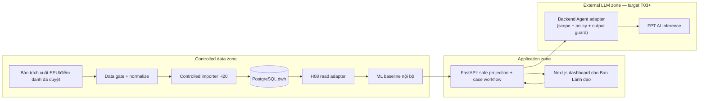
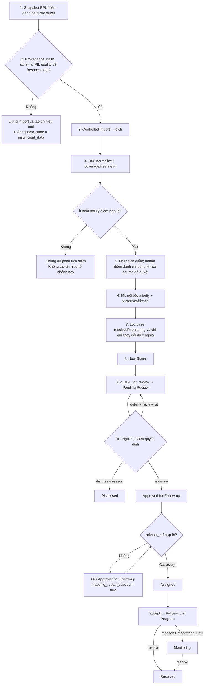
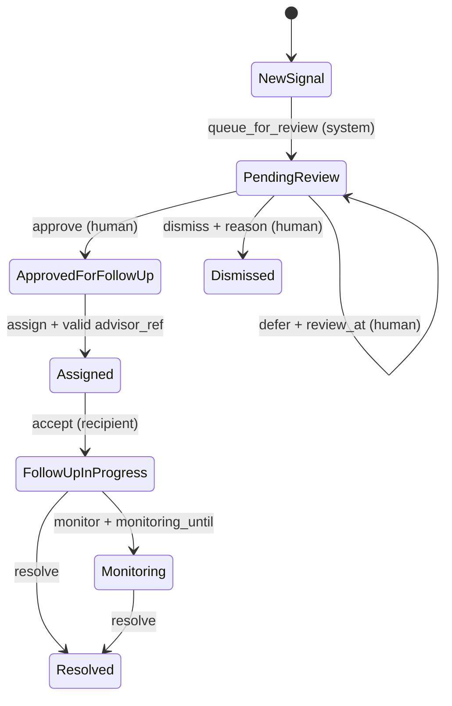
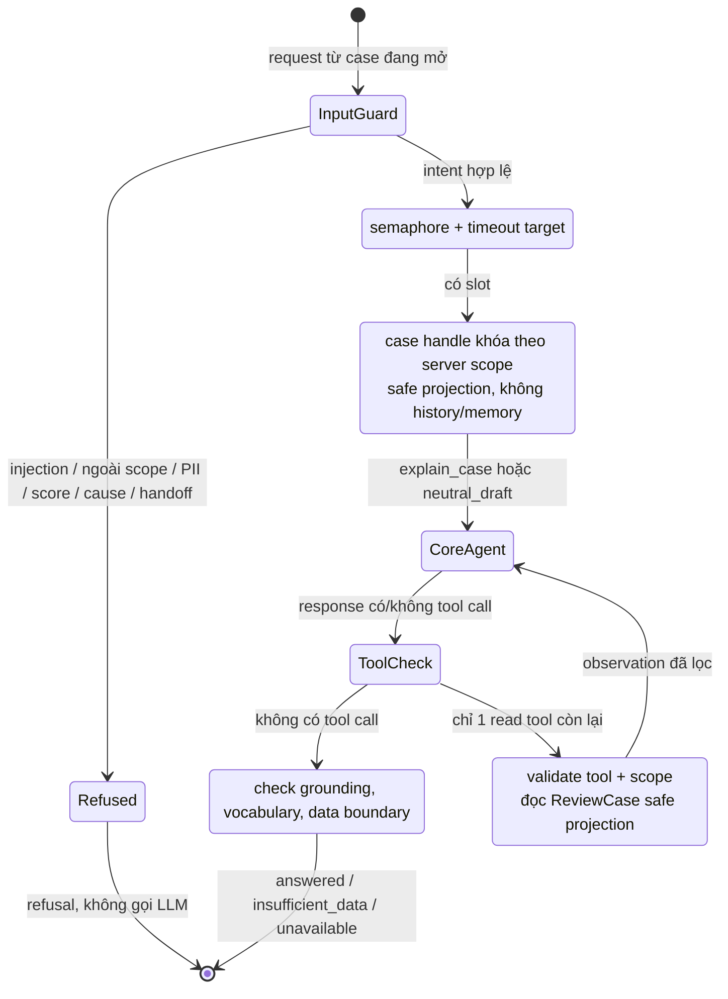

# Kiến trúc hệ thống tối thiểu — Silent Shield MVP

> **Owner:** Hoàng · **Task:** H05a · **Vai trò:** SoT kiến trúc tối thiểu cho `H06b` / `H10` / `H07`.
>
> Tài liệu này làm rõ ranh giới kỹ thuật và luồng vận hành; không thay [PRD](../02-product/04-prd.md), [Ethics](../02-product/05-ethics.md) hay [Process](../02-product/03-process.md). Đặc biệt, nó **không tự tạo** API/schema Agent khi `H11a` và `T03` chưa hoàn thành.

## 1. Cách đọc tài liệu và trạng thái hiện tại

Silent Shield tạo **tín hiệu cần rà soát** cho một case, không tạo nhãn hay kết luận về sinh viên. Luồng nghiệp vụ chuẩn và mã state thuộc [Process §3–4](../02-product/03-process.md); tài liệu này chỉ chỉ ra thành phần nào tạo, đọc hoặc chặn từng bước đó. Mục tiêu H05a là khóa boundary đủ cho H06b (transition), H10 (data contract) và H07 (runbook), không thay thế các contract triển khai tiếp theo.

| Câu hỏi | Nguồn chuẩn |
|:--|:--|
| Sản phẩm được phép nói/làm gì? | [PRD](../02-product/04-prd.md) và [Ethics](../02-product/05-ethics.md) |
| State, action và người được chuyển case? | [Process §4](../02-product/03-process.md) |
| Nguồn EPU, data gate và dữ liệu cấm? | [Contract EPU](04-epu-data-integration-contract.md) |
| Scoring, coverage, threshold, fairness? | [Data-ML / fairness](08-data-ml-scoring-fairness-contract.md) |
| Task nào đã có code/contract? | [Sprint](../03-project/03-sprint.md) và code/test trong `backend/` |

### 1.1 Snapshot delivery trong workspace

Các ô trong sơ đồ dưới đây là **kiến trúc mục tiêu**; không phải tất cả đã chạy. Bảng này ngăn việc hiểu nhầm một mũi tên logic là một feature đã ship.

| Slice | Trạng thái hiện tại | Hệ quả khi đọc sơ đồ |
|:--|:--|:--|
| H06b — core transition | Có `FastAPI` route + in-memory store và test cho state machine | Đây chưa phải public `ReviewCase`, RBAC hay persistence production |
| H10 — EPU/Data-ML contract | **Done** — EPU + Data-ML + decision #17 | Contract khóa; **chưa** có import EPU hay nguồn đã duyệt (`M05b`) |
| H19 / H20 / H08 / M02 | Chưa hoàn tất | Chưa có DWH import, scoring output hay case generation end-to-end |
| H06a / H11a | Mở / blocked theo Sprint | Public projection an toàn, error semantics cho UI/Agent chưa phải contract đã phát hành |
| T03 / T01 / T02 | Blocked theo Sprint | Chưa có `app/agent`, FPT client, endpoint, tool dispatcher, fixture hay grounding/refusal suite |
| FPT settings | Có cấu hình FPT/timeout/concurrency trong `backend/app/config.py` | Đây chỉ là cấu hình, **không** chứng minh ReAct hoặc agent runtime đang chạy |

Vì vậy, phần Agent bên dưới mô tả **target pattern có rào chắn** cho `H11a → T03 → T01 → T02`. Trước gate đó, MVP không được tuyên bố có ReAct/tool loop.

## 2. System context, trust zones và containers

Stack đã chốt là FastAPI + Next.js; FPT AI Inference là LLM primary và backend dự kiến deploy AWS theo [Decisions](../03-project/04-decisions.md). Provider backup chỉ được dùng theo quyết định/cấu hình được duyệt và cùng data boundary.

Không có đường `browser → FPT`: frontend không giữ API key và chỉ gọi backend. FPT chỉ nhận context đã được backend lọc.

| Container | Input / trigger | Output cho consumer | Ranh giới bắt buộc |
|:--|:--|:--|:--|
| Bản trích xuất đã duyệt | Snapshot có owner, approval, hash và provenance | Artifact ngoài repo | Không raw PII, token, reference clone hoặc dữ liệu synthetic trên đường MVP |
| Data gate / normalize | Snapshot đã duyệt | Logical tables + `source_manifest` + `data_quality_report` | Fail-closed khi approval/hash/schema/quality không đạt; không bù bằng heuristic |
| H20 importer + `dwh` | Artifact đã qua gate | Snapshot versioned cho internal read | Importer là CLI/service nội bộ, **không** là public endpoint; transaction atomic/idempotent |
| H08 read adapter | Snapshot `dwh` hợp lệ | `NormalizedStudentRecord` / `ScoringFeatures` | Không cross-source join; thiếu nguồn phải mang `insufficient_data` |
| ML baseline nội bộ | Feature + coverage/freshness | Priority nội bộ, factors/evidence, `model_version`, `calculated_at` | Không public raw score/trọng số; audit attribute và outcome không vào scoring |
| FastAPI | Internal result + care command từ người | Public/agent-safe projection, workflow response | Không để Agent đổi case; không lộ PII, raw score, `is_dropout_outcome`, audit-group field |
| Next.js | API projection | Dashboard review cho **Ban Lãnh đạo**; hành động của người | Không tự tính/fallback priority khi API thiếu; không giữ FPT key |
| Backend Agent adapter — target | Request đang ở scope + safe projection | Câu trả lời grounded, refusal hoặc neutral draft | Read-only; chỉ backend gọi FPT; không truy cập DWH trực tiếp hay ghi/sent action |
| FPT AI Inference — target | Prompt/context đã lọc bởi backend | Text/structured response hoặc tool request bị giới hạn | Là external recipient: không nhận raw data, PII, score, outcome, group audit hoặc chain-of-thought |

## 3. Vòng đời dữ liệu, evidence và case

Các object dưới đây có lifecycle khác nhau. Tách chúng giúp thấy rõ cái gì cần version, cái gì được public và cái gì Agent không được đọc.

| Object / nơi sở hữu | Mục đích và tối thiểu phải giữ | Consumer được phép | Trạng thái contract |
|:--|:--|:--|:--|
| Source snapshot trong `dwh` | `source_id`, hash, provenance, thời điểm, bảng domain và quality report | Importer, H08 | H19/H20 pending; không public |
| Internal scoring evidence | Feature hợp lệ, factors, coverage/freshness, threshold/model version, `calculated_at`; raw score chỉ nội bộ | ML + API projection | M02/H18 pending |
| `ReviewCase` safe projection | `review_priority_band`, factors/evidence, coverage, freshness, data state, limitations, model version/thời điểm tính, case state | UI và Agent context sau scope filter | H06a/H11a pending; **không** đồng nhất với `TransitionResponse` H06b |
| Care state/history | State chuẩn, action của con người/hệ thống, actor, timestamp, reason/review time, `mapping_repair_queued` | Workflow API, reviewer/recipient theo scope | H06b hiện chỉ là core in-memory; persistence/H03 pending |
| Agent-run metadata | Request class, tool name/status, redacted case handle, model/version, duration, `run_status`/grounding refs | Technical audit tối thiểu | T03 pending; không log raw context, PII hoặc reasoning trace |

`academic_status.is_dropout_outcome` chỉ phục vụ evaluation nội bộ. Nó không đi từ snapshot sang scoring, `ReviewCase`, care history public hay Agent context. Tương tự, thuộc tính nhóm chỉ có chỗ trong fairness audit đủ điều kiện, không phải explanation của một case.

## 4. Luồng dữ liệu đến case — happy path và fail-closed

Nhánh điểm danh không được dùng dữ liệu giả. Nếu export điểm danh chưa được phê duyệt, chỉ **nhánh chuyên cần** trả `insufficient_data`; hệ thống không tự suy ra chuỗi điểm danh. Fairness là report gate tách biệt: thiếu audit attribute/ground truth/mẫu số thì fairness trả `insufficient_data`, không trở thành feature scoring, Agent context hoặc transition case.

### 4.1 Phạm vi của từng điều kiện thiếu dữ liệu

| Điều kiện | Capability bị ảnh hưởng | Hành vi case/routing | Cách UI/Agent phải nói |
|:--|:--|:--|:--|
| Approval, hash, schema, PII gate hoặc freshness nguồn fail | Toàn snapshot | Không import, không tạo tín hiệu/case mới từ snapshot đó | Nêu nguồn chưa đủ điều kiện; không gọi là “ổn định” |
| Không có tối thiểu hai kỳ điểm hợp lệ | Phân tích trend điểm | Không tạo tín hiệu dựa trên trend điểm | “Chưa đủ dữ liệu điểm theo kỳ để giải thích” |
| Không có chuỗi điểm danh đã duyệt | Nhánh chuyên cần | Không impute; vẫn xét các nhánh hợp lệ khác theo contract | “Dữ liệu chuyên cần chưa sẵn sàng”, không suy đoán |
| `advisor_ref` thiếu/sai scope | Routing/handoff | Review và `approve` vẫn có thể diễn ra; `assign` bị reject, case giữ `approved_for_follow_up` và vào mapping-repair queue | Nêu bàn giao đang chờ sửa mapping, không nói đã gửi case |
| Thiếu audit group, ground truth hoặc N đủ | Fairness/evaluation | Không ảnh hưởng state case; fairness report fail closed | “Audit fairness chưa đủ dữ liệu” |
| `academic_status.is_dropout_outcome` không có/unknown | Evaluation nội bộ | Không được biến thành data thiếu cho Agent hay lý do cá nhân | Không nhắc outcome hoặc đoán dropout |

Ngưỡng cụ thể cho quality/coverage thuộc H10/H11a; architecture không được tự đặt ngưỡng thay cho contract đó.

## 5. State boundary của care workflow

Mã API và transition chuẩn nằm ở [Process §4](../02-product/03-process.md) và được H06b test. Sơ đồ chỉ dùng các **state chuẩn**; `mapping-repair` là queue/cờ nội bộ, không phải state mới.

| State hiển thị | API code | Ghi chú kiến trúc |
|:--|:--|:--|
| `New Signal` | `new_signal` | Chỉ xuất hiện sau gate, analysis và dedupe |
| `Pending Review` | `pending_review` | `defer` giữ nguyên state và bắt buộc `review_at` |
| `Approved for Follow-up` | `approved_for_follow_up` | Approve không phải handoff; thiếu mapping vẫn giữ state này |
| `Dismissed` | `dismissed` | Terminal cho vòng hiện tại; phải có reason chuẩn hóa |
| `Assigned` | `assigned` | Chỉ sau `assign` với `advisor_ref` hợp lệ |
| `Follow-up in Progress` | `follow_up_in_progress` | Người nhận đã `accept` |
| `Resolved` | `resolved` | Terminal; thay đổi dữ liệu đáng kể mới có case mới |
| `Monitoring` | `monitoring` | Có hạn theo dõi và có thể `resolve` thành `resolved` |

Không dùng `new`, `in_review`, `deferred`, `handed_off`, `Low/Medium/High Risk` làm state/field alias. Agent/LLM không được gọi `queue_for_review`, `approve`, `dismiss`, `defer`, `assign`, `accept`, `resolve` hay `monitor`; H06b đã reject `actor_kind=agent|llm`.

## 6. Agent và bounded ReAct — target pattern, chưa phải runtime

### 6.1 Điều đang có và điều chưa có

Hiện không có module `app/agent`, FPT/OpenAI client, chat endpoint, tool registry/dispatcher, LangGraph, fixture Agent hoặc test grounding/refusal. `backend/app/main.py` chỉ mount health và case router; FPT/timeout/tracing mới là settings. Vì thế, cách mô tả chính xác của MVP hiện tại là: **chưa có Agent/ReAct runtime**; chỉ có guard cấm Agent/LLM đổi state.

Tài liệu flow LangGraph của EduInsight được dùng như **tham khảo kiến trúc**, không phải source of truth hoặc code để copy sang Silent Shield. ReAct trong Silent Shield phải bị thu hẹp theo PRD FR-08, Ethics §8 và boundary dữ liệu dưới đây.

### 6.2 Những gì được giữ và loại bỏ từ pattern tham khảo

| Thành phần trong pattern tham khảo | Silent Shield target | Lý do |
|:--|:--|:--|
| Input guardrail trước graph | **Giữ**: chặn injection, yêu cầu ngoài phạm vi, PII exfiltration, score/cause/discipline/handoff | Request bị chặn trả refusal chuẩn hóa, không gọi LLM |
| Admission/concurrency semaphore | **Giữ**: dùng `MAX_CONCURRENT_AGENT_RUNS` và timeout đã có trong config khi runtime được tạo | Bảo vệ backend/credit; chưa chứng minh semaphore đã chạy |
| State initialization | **Thu hẹp**: chỉ case đang mở + safe projection server-side | Không truyền chat history, long-term memory, raw session hay context từ case khác trong MVP |
| LLM router / fast response | **Không port**: policy route do backend quyết định intent `explain_case`/`neutral_draft`/refuse | Không cần model thứ hai để điều hướng, tránh câu trả lời ngoài evidence |
| Core ReAct + nhiều tool / 10 vòng | **Thu hẹp**: tối đa một read tool và một vòng observe → answer | MVP chỉ giải thích một `ReviewCase`; không cho loop thu thập dữ liệu tùy ý |
| Output guardrail | **Giữ**: validate grounding, vocabulary, data boundary trước UI | Không hiện claim không có evidence; không lộ chain-of-thought |
| SQL, lookup sinh viên, CLO, dropout tool, RAG/web | **Loại** | Truy cập DWH/PII hoặc tạo/suy diễn output ngoài scope MVP |
| Session persistence / SSE / memory summary | **Deferred** | Không cần cho FR-08; raw AI session không được đưa vào repo/evidence |

### 6.3 Bounded ReAct graph sau `H11a` / `T03`

ReAct ở đây nghĩa là **nhận yêu cầu → chọn một hành động đọc bị giới hạn → quan sát kết quả → trả lời**. Nó không có nghĩa là để LLM tự do truy vấn dữ liệu, thay đổi workflow hoặc hiển thị/lưu reasoning trace.

Đồ thị này là **target design**, không phải endpoint/implementation đã có. Tên endpoint, input/output schema, error code và tool payload vẫn là `TBD` của H11a/T03. Với câu hỏi đơn giản, backend có thể dựng single-turn grounded context và không cần tool call; điều đó vẫn an toàn hơn một ReAct loop không cần thiết.

### 6.4 Tool boundary tối thiểu sau khi T03 bắt đầu

| Capability / tool target | Dữ liệu hoặc action được phép | Guard bắt buộc | Không được phép |
|:--|:--|:--|:--|
| `read_review_case_context` | Chỉ safe projection của case đang mở: priority band, factors/evidence, coverage, freshness/data state, limitations, `model_version`, `calculated_at`, case state | Scope xác định ở server; tối đa một lượt đọc; tool result được adapter validate | Arbitrary case search; raw score; PII; `advisor_ref`; outcome; audit-group fields; DWH/raw query |
| Generate explanation / neutral draft | Tóm tắt dữ kiện, output model và giới hạn; có thể soạn bản nháp trung lập | Output phải phân biệt fact/model output/limitation, qua vocabulary + grounding guard | Chẩn đoán, suy đoán nguyên nhân, tạo/sửa priority hoặc kết luận dropout |
| Gửi email/notification | Không phải Agent tool | Nếu có gửi, đó là human-approved workflow riêng sau care gate | Tự gửi hoặc tự chọn người nhận |
| Workflow/score/data tools | Không có trong allowlist | Deny at dispatcher/policy guard | Transition case, assign, recompute score, write DWH, import data, SQL, RAG/web/external search |

Agent không cần biết danh tính hoặc thông tin liên hệ để giải thích/draft. Bản nháp chỉ là output text và luôn cần người có thẩm quyền duyệt/gửi. Frontend không gọi FPT trực tiếp và không giữ API key.

### 6.5 Output, lỗi và audit an toàn

Response target nên có một trạng thái dễ phân biệt: `answered`, `refused`, `insufficient_data` hoặc `unavailable`; cùng facts/evidence refs, model output được phép và limitations khi phù hợp. Đây là **mục tiêu contract**, chưa phải API value hiện tại.

| Tình huống | Hành vi target | Cấm fallback |
|:--|:--|:--|
| Hỏi score, nguyên nhân đời tư, chẩn đoán, kỷ luật, handoff hay gửi email | Refusal nêu ranh giới | Không gọi tool/LLM để suy đoán hoặc thực thi |
| Context ngoài scope, thiếu coverage/freshness hoặc evidence | `insufficient_data` với phần dữ liệu còn thiếu | Không bịa lý do, không suy ra từ outcome/group |
| Tool bị từ chối/lỗi hoặc FPT timeout/429/invalid response | `unavailable` hoặc câu trả lời fail-closed; UI workflow vẫn dùng được | Không tự chuyển provider/dataset hoặc tự tính priority; backup theo Decision #6 chỉ sau cấu hình/approval và cùng data boundary |
| Câu trả lời có claim không bám evidence | Output guard từ chối/loại claim trước khi trả UI | Không hiển thị claim không có grounding ref |

Chỉ audit metadata đã giảm thiểu (tool name/status, model/version, duration, `run_status`, grounding refs). Không log raw Agent context, session nhạy cảm hay chain-of-thought; tracing mặc định phải tắt và chỉ bật khi có approval cho external recipient/context phù hợp.

### 6.6 Điều kiện nghiệm thu khi triển khai Agent

`T03` cần mock test cho ít nhất năm case: answer grounded có refs; `insufficient_data`; yêu cầu score/dropout/cause; cố gọi transition/send; tool timeout/error; leakage PII/outcome/audit attribute; neutral draft không tự gửi. Đây bổ sung cho, không thay thế, test H06b đã có về việc Agent/LLM bị cấm đổi case state.

## 7. Trust, privacy và care boundary

| Ranh giới | Quy tắc kiến trúc |
|:--|:--|
| Data privacy | Chỉ snapshot đã duyệt + pseudonymized; không PII/secret/raw reference trong repo, public API, Agent context, evidence, slide hay video |
| Data reliability | Coverage thấp/cũ/thiếu kỳ trả `insufficient_data`; im lặng có giải thích không được diễn đạt là “ổn định” |
| Score | Raw score/trọng số là internal ML; UI/API nghiệp vụ chỉ thấy mức ưu tiên rà soát và evidence được phép |
| Fairness | Audit attribute chỉ dùng cho metric khi đủ approval/ground truth/mẫu số; tách khỏi scoring, case cá nhân và Agent |
| Identity/scope | Khi có Agent/public API, backend phải suy ra role/scope server-side; không coi `actor_kind` do client tự khai là RBAC production |
| Care | Con người review trước handoff và quyết định cách tiếp cận; Agent có thể draft, không thể approve/assign/send/discipline |
| External LLM | Browser không gọi FPT; backend chỉ gửi safe projection đã lọc; không có SQL/RAG/web hoặc external-data fallback |

## 8. Ngoài phạm vi kiến trúc MVP

- Wellbeing score/trục D0–D3 như nhãn sinh viên, chẩn đoán sức khỏe tâm thần hoặc nguyên nhân cá nhân.
- Forecasting/gated fusion hậu MVP, LMS/RAG mở rộng, adaptive tutor, OCR/TTS, career, web search của Agent.
- Synthetic generator/reference clone trên đường MVP hoặc claim hybrid/Agent/ReAct đã ship khi chưa có code/test.
- SIS live feed, RBAC production đầy đủ, retention automation, email delivery automation và access-audit production.

Điểm danh theo thời gian vẫn **thuộc MVP** sau nguồn `H15` đã duyệt. Thiếu nguồn không chuyển nó sang Post-MVP và không cho phép tạo chuỗi giả.

## 9. Con trỏ triển khai và tài liệu liên quan

| Nhu cầu | Tài liệu / bằng chứng |
|:--|:--|
| Product scope và FR-08 | [PRD](../02-product/04-prd.md) |
| Care states, actions, mapping-repair | [Process §4](../02-product/03-process.md) |
| Privacy, fairness, Agent boundary | [Ethics](../02-product/05-ethics.md) |
| EPU schema, fail-closed và agent-safe fields | [Contract EPU](04-epu-data-integration-contract.md) |
| Scoring / fairness semantics | [Data-ML contract](08-data-ml-scoring-fairness-contract.md) |
| Versioned DWH/import | [Persistence schema](07-mvp-persistence-schema.md) |
| FPT provider setup only | [FPT AI API](01-fpt-ai-api.md) |
| Current task gates | [Sprint](../03-project/03-sprint.md) |
| H06b evidence that Agent cannot transition | [`domain.py`](../../backend/app/cases/domain.py) · [`test_case_transitions.py`](../../backend/tests/test_case_transitions.py) |
| Deploy/ops (draft) | [06-deploy-runbook.md](06-deploy-runbook.md) |
