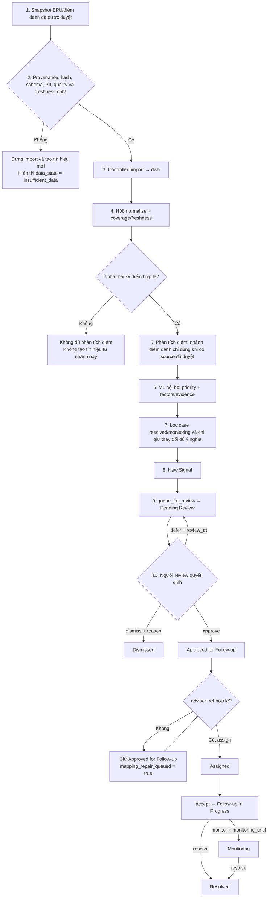
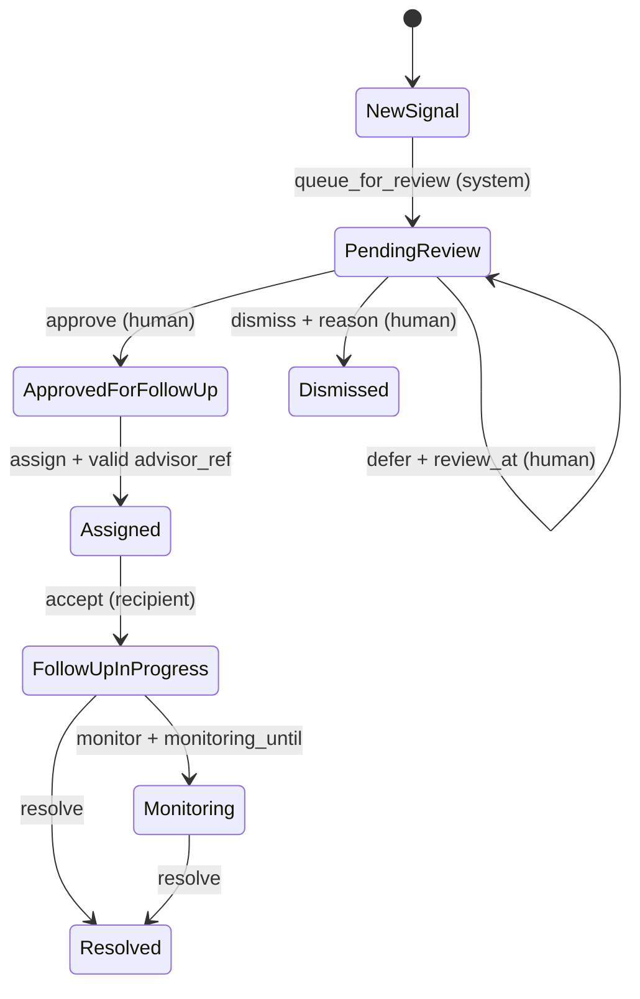
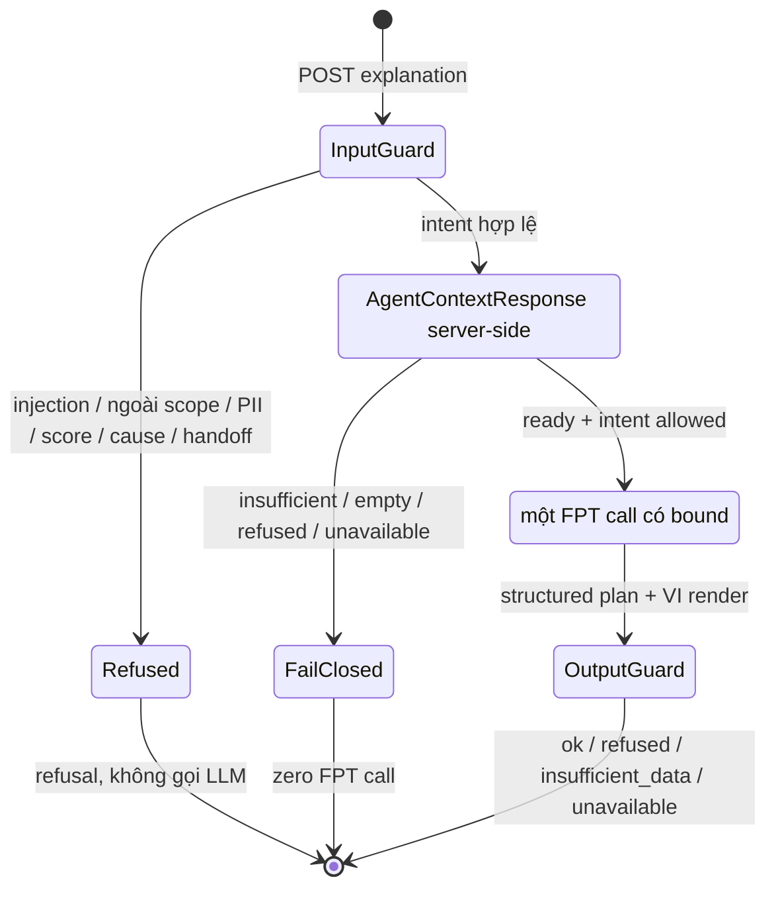

# Kiến trúc hệ thống tối thiểu — Silent Shield MVP

> **Owner:** Hoàng · **Task:** H05a · **Vai trò:** SoT kiến trúc tối thiểu cho `H06b` / `H10` / `H07`.
>
> Tài liệu này làm rõ ranh giới kỹ thuật và luồng vận hành; không thay [PRD](../02-product/04-prd.md), [Ethics](../02-product/05-ethics.md) hay [Process](../02-product/03-process.md). Status/delta triển khai Agent sau T02 được khóa tại [plan H23–H26](12-agent-runtime-integration-plan.md).

## 1. Cách đọc tài liệu và trạng thái hiện tại

Silent Shield tạo **tín hiệu cần rà soát** cho một case, không tạo nhãn hay kết luận về sinh viên. Luồng nghiệp vụ chuẩn và mã state thuộc [Process §3–4](../02-product/03-process.md); tài liệu này chỉ chỉ ra thành phần nào tạo, đọc hoặc chặn từng bước đó. Mục tiêu H05a là khóa boundary đủ cho H06b (transition), H10 (data contract) và H07 (runbook), không thay thế các contract triển khai tiếp theo.

| Câu hỏi | Nguồn chuẩn |
|:--|:--|
| Sản phẩm được phép nói/làm gì? | [PRD](../02-product/04-prd.md) và [Ethics](../02-product/05-ethics.md) |
| State, action và người được chuyển case? | [Process §4](../02-product/03-process.md) |
| Nguồn EPU, data gate và dữ liệu cấm? | [Contract EPU](04-epu-data-integration-contract.md) |
| Scoring, coverage, threshold, fairness? | [Data-ML / fairness](08-data-ml-scoring-fairness-contract.md) |
| Task nào đã có code/contract? | [Sprint](../03-project/03-sprint.md) và code/test trong `backend/` |

### 1.1 Snapshot delivery trong workspace

Các ô trong sơ đồ dưới đây là **kiến trúc mục tiêu**; không phải tất cả đã chạy. Bảng này ngăn việc hiểu nhầm một mũi tên logic là một feature đã ship.

| Slice | Trạng thái hiện tại | Hệ quả khi đọc sơ đồ |
|:--|:--|:--|
| H06b — core transition | Có `FastAPI` route + in-memory store và test cho state machine | Đây chưa phải RBAC production; public care API thuộc H03 |
| H10 / M05b / H15 | **Done** — EPU + Data-ML + approved semester + attendance-over-time | Contract + nguồn duyệt (decision #18); Live import qua H20 |
| H19 / H20 / H08 / M02 | Done | Schema + import CLI + read adapter + baseline scoring |
| H06a / H11a / H02 / H03 / H04 | Done | Public `ReviewCase`, care transitions, threshold/fairness APIs |
| G05–G04 | **Done** | FE consumes list/detail/care/config; **không** có FE Agent explain UI |
| T03 / T01 / T02 | **Done — core/library** | Guardrail/stub/FPT text adapter + mocked tests |
| H23–H26 Agent HTTP | **Done — backend HTTP** | Server `AgentContext`; `POST /review-cases/{case_id}/explanation` mounted; mocked FPT E2E. **Không** claim FE Agent UI, live FPT smoke, hay production RBAC |
| FPT settings/client | Wired trong runtime H25 (transport harden) | Live FPT = optional/SKIP trong verify; demo identity ≠ production RBAC |

FR-08 claimable ở **backend HTTP** (H26). FE Agent UI là consumer task riêng — chưa ship. Chi tiết: [plan H23–H26](12-agent-runtime-integration-plan.md) · [H11b FE/agent docs](10-fe-agent-integration-contract.md).

## 2. System context, trust zones và containers

Stack đã chốt là FastAPI + Next.js; FPT AI Inference là LLM primary và backend dự kiến deploy AWS theo [Decisions](../03-project/04-decisions.md). Provider backup chỉ được dùng theo quyết định/cấu hình được duyệt và cùng data boundary.

Không có đường `browser → FPT`: frontend không giữ API key và chỉ gọi backend. FPT chỉ nhận context đã được backend lọc. FE **không** gọi explanation endpoint trong G05–G04.

| Container | Input / trigger | Output cho consumer | Ranh giới bắt buộc |
|:--|:--|:--|:--|
| Bản trích xuất đã duyệt | Snapshot có owner, approval, hash và provenance | Artifact ngoài repo | Không raw PII, token, reference clone hoặc dữ liệu synthetic trên đường MVP |
| Data gate / normalize | Snapshot đã duyệt | Logical tables + `source_manifest` + `data_quality_report` | Fail-closed khi approval/hash/schema/quality không đạt; không bù bằng heuristic |
| H20 importer + `dwh` | Artifact đã qua gate | Snapshot versioned cho internal read | Importer là CLI/service nội bộ, **không** là public endpoint; transaction atomic/idempotent |
| H08 read adapter | Snapshot `dwh` hợp lệ | `NormalizedStudentRecord` / `ScoringFeatures` | Không cross-source join; thiếu nguồn phải mang `insufficient_data` |
| ML baseline nội bộ | Feature + coverage/freshness | Priority nội bộ, factors/evidence, `model_version`, `calculated_at` | Không public raw score/trọng số; audit attribute và outcome không vào scoring |
| FastAPI | Internal result + care command từ người | Public/agent-safe projection, workflow response | Không để Agent đổi case; không lộ PII, raw score, `is_dropout_outcome`, audit-group field |
| Next.js | API projection | Dashboard review cho **Ban Lãnh đạo**; hành động của người | Không tự tính/fallback priority khi API thiếu; không giữ FPT key |
| Backend Agent adapter | Request trong scope + safe projection | Câu trả lời grounded, refusal hoặc neutral draft | Read-only; chỉ backend gọi FPT; H23–H26 Done (mocked E2E); không claim FE UI |
| FPT AI Inference | Prompt/context đã lọc bởi backend | Text/structured response | External recipient: không nhận raw data, PII, score, outcome, group audit hoặc CoT; live SKIP in default verify |

## 3. Vòng đời dữ liệu, evidence và case

Các object dưới đây có lifecycle khác nhau. Tách chúng giúp thấy rõ cái gì cần version, cái gì được public và cái gì Agent không được đọc.

| Object / nơi sở hữu | Mục đích và tối thiểu phải giữ | Consumer được phép | Trạng thái contract |
|:--|:--|:--|:--|
| Source snapshot trong `dwh` | `source_id`, hash, provenance, thời điểm, bảng domain và quality report | Importer, H08 | H19/H20 Done; không public |
| Internal scoring evidence | Feature hợp lệ, factors, coverage/freshness, threshold/model version, `calculated_at`; raw score chỉ nội bộ | ML + API projection | M02/H18 Done |
| `ReviewCase` safe projection | `review_priority_band`, factors/evidence, coverage, freshness, data state, limitations, model version/thời điểm tính, case state | UI và Agent context sau scope filter | H06a + H11a + H02 Done; **không** đồng nhất với `TransitionResponse` H06b |
| Care state/history | State chuẩn, action của con người/hệ thống, actor, timestamp, reason/review time, `mapping_repair_queued` | Workflow API, reviewer/recipient theo scope | H06b + **H03 Done** — assign resolves `advisor_ref` via H08 (client ignored); persistence production vẫn sau |
| Agent-run metadata | Request class, tool name/status, redacted case handle, model/version, duration, `run_status`/grounding refs | Technical audit tối thiểu | H23–H26 Done (backend); không log raw context, PII hoặc reasoning trace |

`academic_status.is_dropout_outcome` chỉ phục vụ evaluation nội bộ. Nó không đi từ snapshot sang scoring, `ReviewCase`, care history public hay Agent context. Tương tự, thuộc tính nhóm chỉ có chỗ trong fairness audit đủ điều kiện, không phải explanation của một case.

## 4. Luồng dữ liệu đến case — happy path và fail-closed

Nhánh điểm danh không được dùng dữ liệu giả. Nếu export điểm danh chưa được phê duyệt, chỉ **nhánh chuyên cần** trả `insufficient_data`; hệ thống không tự suy ra chuỗi điểm danh. Fairness là report gate tách biệt: thiếu audit attribute/ground truth/mẫu số thì fairness trả `insufficient_data`, không trở thành feature scoring, Agent context hoặc transition case.

### 4.1 Phạm vi của từng điều kiện thiếu dữ liệu

| Điều kiện | Capability bị ảnh hưởng | Hành vi case/routing | Cách UI/Agent phải nói |
|:--|:--|:--|:--|
| Approval, hash, schema, PII gate hoặc freshness nguồn fail | Toàn snapshot | Không import, không tạo tín hiệu/case mới từ snapshot đó | Nêu nguồn chưa đủ điều kiện; không gọi là “ổn định” |
| Không có tối thiểu hai kỳ điểm hợp lệ | Phân tích trend điểm | Không tạo tín hiệu dựa trên trend điểm | “Chưa đủ dữ liệu điểm theo kỳ để giải thích” |
| Không có chuỗi điểm danh đã duyệt | Nhánh chuyên cần | Không impute; vẫn xét các nhánh hợp lệ khác theo contract | “Dữ liệu chuyên cần chưa sẵn sàng”, không suy đoán |
| `advisor_ref` thiếu/sai scope | Routing/handoff | Review và `approve` vẫn có thể diễn ra; `assign` bị reject, case giữ `approved_for_follow_up` và vào mapping-repair queue | Nêu bàn giao đang chờ sửa mapping, không nói đã gửi case |
| Thiếu audit group, ground truth hoặc N đủ | Fairness/evaluation | Không ảnh hưởng state case; fairness report fail closed | “Audit fairness chưa đủ dữ liệu” |
| `academic_status.is_dropout_outcome` không có/unknown | Evaluation nội bộ | Không được biến thành data thiếu cho Agent hay lý do cá nhân | Không nhắc outcome hoặc đoán dropout |

Ngưỡng cụ thể cho quality/coverage thuộc H10/H11a; architecture không được tự đặt ngưỡng thay cho contract đó.

## 5. State boundary của care workflow

Mã API và transition chuẩn nằm ở [Process §4](../02-product/03-process.md) và được H06b test. Sơ đồ chỉ dùng các **state chuẩn**; `mapping-repair` là queue/cờ nội bộ, không phải state mới.

| State hiển thị | API code | Ghi chú kiến trúc |
|:--|:--|:--|
| `New Signal` | `new_signal` | Chỉ xuất hiện sau gate, analysis và dedupe |
| `Pending Review` | `pending_review` | `defer` giữ nguyên state và bắt buộc `review_at` |
| `Approved for Follow-up` | `approved_for_follow_up` | Approve không phải handoff; thiếu mapping vẫn giữ state này |
| `Dismissed` | `dismissed` | Terminal cho vòng hiện tại; phải có reason chuẩn hóa |
| `Assigned` | `assigned` | Chỉ sau `assign` với `advisor_ref` hợp lệ |
| `Follow-up in Progress` | `follow_up_in_progress` | Người nhận đã `accept` |
| `Resolved` | `resolved` | Terminal; thay đổi dữ liệu đáng kể mới có case mới |
| `Monitoring` | `monitoring` | Có hạn theo dõi và có thể `resolve` thành `resolved` |

Không dùng `new`, `in_review`, `deferred`, `handed_off`, `Low/Medium/High Risk` làm state/field alias. Agent/LLM không được gọi `queue_for_review`, `approve`, `dismiss`, `defer`, `assign`, `accept`, `resolve` hay `monitor`; H06b đã reject `actor_kind=agent|llm`.

## 6. Agent — bounded DAG HTTP (H23–H26 Done)

### 6.1 Điều đang có và điều chưa có

| Đã ship | Chưa ship / không claim |
|:--|:--|
| T03/T01/T02 core/library + guardrail/refusal | FE Agent explain/chat UI |
| H23 server-derived `AgentContext` | Live FPT smoke trong default verify (SKIP) |
| H24 `POST /review-cases/{case_id}/explanation` mounted trên `main.py` | Production RBAC (demo identity only) |
| H25 structured grounding + FPT transport harden | ReAct multi-tool / multi-loop tự do |
| H26 mocked HTTP E2E (M02→context→fake FPT→POST) | Browser → FPT |

FR-08 claimable ở **backend HTTP**. Docs FE/agent sau build: [H11a + H11b](10-fe-agent-integration-contract.md) · [guardrails](08-agent-grounding-guardrails.md) · [runtime plan](12-agent-runtime-integration-plan.md).

Tài liệu flow LangGraph của EduInsight chỉ là **tham khảo**; Silent Shield ship **bounded DAG** (một FPT call), không ReAct loop thu thập dữ liệu tùy ý.

### 6.2 Những gì được giữ và loại bỏ từ pattern tham khảo

| Thành phần trong pattern tham khảo | Silent Shield (shipped) | Lý do |
|:--|:--|:--|
| Input guardrail trước graph | **Giữ** — refusal chuẩn hóa, không gọi LLM khi phạm | Injection / ngoài scope / PII / score / cause / handoff |
| Admission/concurrency | Timeout + provider harden (H25); semaphore config sẵn | Bảo vệ backend/credit |
| State initialization | Server-side `build_agent_context` + safe projection | Không chat history / memory / context case khác |
| LLM router / fast response | **Không port** — backend quyết định intent | Tránh câu trả lời ngoài evidence |
| Core ReAct + nhiều tool / 10 vòng | **Thu hẹp thành DAG**: tối đa một read-context + một FPT call | MVP chỉ giải thích một `ReviewCase` |
| Output guardrail | **Giữ** — grounding, vocabulary, data boundary trước response | Không claim không có evidence; không CoT |
| SQL / PII lookup / dropout / RAG/web | **Loại** | Ngoài scope MVP |
| Session / SSE / memory | **Deferred** | Không cần FR-08 |

### 6.3 Bounded DAG (shipped)

Luồng thực tế: **request → input guard → server context → (optional) một FPT call → output guard → response**. Không phải LLM tự chọn tool vòng lặp.

Schema: [H11a](10-fe-agent-integration-contract.md) (`AgentContextResponse`, problem codes). Command body chỉ `{intent, question, locale}` — browser **không** gửi context.

### 6.4 Tool / capability boundary

| Capability | Được phép | Guard | Không được phép |
|:--|:--|:--|:--|
| Server `build_agent_context` | Safe projection case đang mở | Scope server-side | Arbitrary search; raw score; PII; `advisor_ref` trên agent context; outcome; DWH raw |
| Explanation / neutral draft | Facts + model factors + limitations; draft text | Vocabulary + grounding; `requires_human_approval=true` | Chẩn đoán; suy đoán nguyên nhân; sửa priority / dropout |
| Gửi email/notification | Không phải Agent tool | H22/G06 draft-only riêng (FR-12) | Tự gửi / tự chọn người nhận |
| Workflow / score / data write | Không trong allowlist | Deny | Transition, assign, recompute, SQL, RAG |

Frontend không gọi FPT và không giữ API key. FE hiện **không** gọi `POST …/explanation` — demo Agent qua API/Swagger hoặc mocked tests.

### 6.5 Output, lỗi và audit an toàn

Response dùng status `ok` / `refused` / `insufficient_data` / `unavailable` (agent schemas), kèm facts/refs và limitations khi phù hợp.

| Tình huống | Hành vi | Cấm fallback |
|:--|:--|:--|
| Hỏi score, nguyên nhân đời tư, chẩn đoán, kỷ luật, handoff hay gửi email | Refusal | Không gọi FPT để suy đoán hoặc thực thi |
| Context ngoài scope / thiếu coverage | `insufficient_data` | Không bịa lý do từ outcome/group |
| FPT timeout/429/invalid | `unavailable`; care UI vẫn dùng được | Không tự đổi provider/dataset hay tự tính priority |
| Claim không bám evidence | Output guard từ chối | Không trả claim không grounding |

Audit chỉ metadata tối thiểu; không log raw context / CoT.

### 6.6 Nghiệm thu Agent (đã đạt ở backend HTTP)

H23–H26: mocked HTTP E2E grounded; insufficient/stale; score/dropout/cause refusal; no transition/send; provider harden; forbidden-field scan; neutral draft không tự gửi. Live FPT và FE Agent UI **không** thuộc DoD H26. H06b vẫn cấm Agent/LLM đổi case state.

## 7. Trust, privacy và care boundary

| Ranh giới | Quy tắc kiến trúc |
|:--|:--|
| Data privacy | Chỉ snapshot đã duyệt + pseudonymized; không PII/secret/raw reference trong repo, public API, Agent context, evidence, slide hay video |
| Data reliability | Coverage thấp/cũ/thiếu kỳ trả `insufficient_data`; im lặng có giải thích không được diễn đạt là “ổn định” |
| Score | Raw score/trọng số là internal ML; UI/API nghiệp vụ chỉ thấy mức ưu tiên rà soát và evidence được phép |
| Fairness | Audit attribute chỉ dùng cho metric khi đủ approval/ground truth/mẫu số; tách khỏi scoring, case cá nhân và Agent |
| Identity/scope | Khi có Agent/public API, backend phải suy ra role/scope server-side; không coi `actor_kind` do client tự khai là RBAC production |
| Care | Con người review trước handoff và quyết định cách tiếp cận; Agent có thể draft, không thể approve/assign/send/discipline |
| External LLM | Browser không gọi FPT; backend chỉ gửi safe projection đã lọc; không có SQL/RAG/web hoặc external-data fallback |

## 8. Ngoài phạm vi kiến trúc MVP

- Wellbeing score/trục D0–D3 như nhãn sinh viên, chẩn đoán sức khỏe tâm thần hoặc nguyên nhân cá nhân.
- Forecasting/gated fusion hậu MVP, LMS/RAG mở rộng, adaptive tutor, OCR/TTS, career, web search của Agent.
- Synthetic generator/reference clone trên đường MVP hoặc claim hybrid/Agent/ReAct đã ship khi chưa có code/test.
- SIS live feed, RBAC production đầy đủ, retention automation, email delivery automation và access-audit production.

Điểm danh theo thời gian vẫn **thuộc MVP** sau nguồn `H15` đã duyệt. Thiếu nguồn không chuyển nó sang Post-MVP và không cho phép tạo chuỗi giả.

## 9. Con trỏ triển khai và tài liệu liên quan

| Nhu cầu | Tài liệu / bằng chứng |
|:--|:--|
| Product scope và FR-08 | [PRD](../02-product/04-prd.md) |
| Care states, actions, mapping-repair | [Process §4](../02-product/03-process.md) |
| Privacy, fairness, Agent boundary | [Ethics](../02-product/05-ethics.md) |
| EPU schema, fail-closed và agent-safe fields | [Contract EPU](04-epu-data-integration-contract.md) |
| Scoring / fairness semantics | [Data-ML contract](08-data-ml-scoring-fairness-contract.md) |
| Versioned DWH/import | [Persistence schema](07-mvp-persistence-schema.md) |
| FPT provider setup only | [FPT AI API](01-fpt-ai-api.md) |
| Agent runtime integration/hardening | [Plan H23–H26](12-agent-runtime-integration-plan.md) |
| Current task gates | [Sprint](../03-project/03-sprint.md) |
| H06b evidence that Agent cannot transition | [`domain.py`](../../backend/app/cases/domain.py) · [`test_case_transitions.py`](../../backend/tests/test_case_transitions.py) |
| Deploy/ops (draft) | [06-deploy-runbook.md](06-deploy-runbook.md) |
