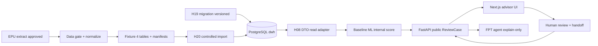
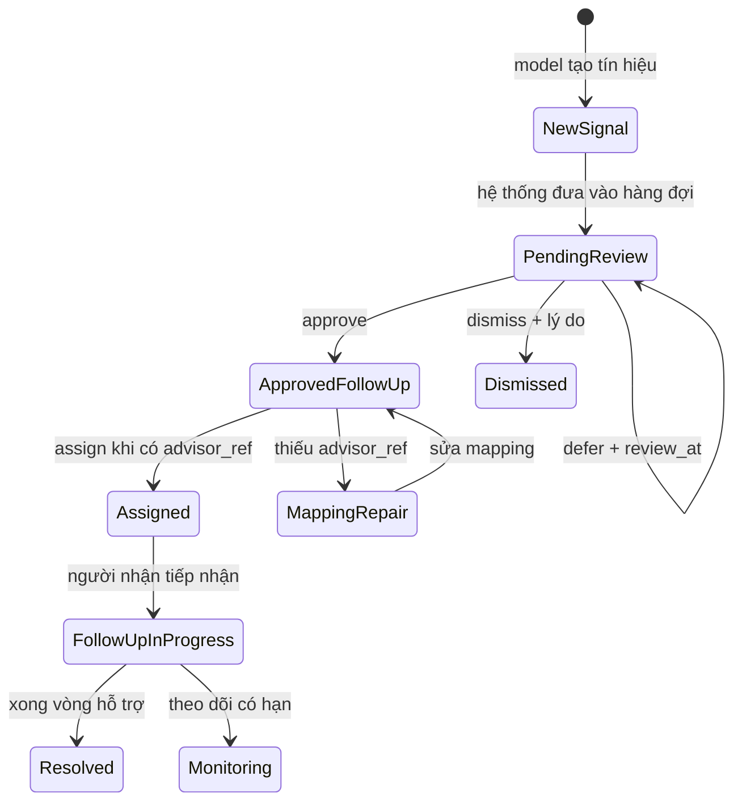

# Kiến trúc hệ thống tối thiểu — Silent Shield MVP

> **Owner:** Hoàng · **Task:** H05a · **Trạng thái:** SoT tối thiểu để mở `H06b` / `H10` / `H07`.
>
> Không thay [PRD](../02-product/04-prd.md), [Ethics](../02-product/05-ethics.md) hay [Process](../02-product/03-process.md). Chi tiết schema EPU → `H10` + [contract EPU](04-epu-data-integration-contract.md). Runbook deploy → [06-deploy-runbook.md](06-deploy-runbook.md) (`H07`; draft until `D4`).

## 1. Mục đích

Khóa ranh giới container, luồng dữ liệu và trust boundary của MVP 48 giờ để:

- `H06b` implement transition API theo [Process §4](../02-product/03-process.md);
- `H10` hoàn thiện contract EPU/Data-ML trên nền điểm theo kỳ + điểm danh theo thời gian + fail-closed;
- `H07` viết runbook (env, CORS, seed, health, smoke, rollback) khớp stack này.

## 2. Containers

| Container | Vai trò MVP | Không làm |
|:----------|:------------|:----------|
| Bản trích xuất EPU/điểm danh đã duyệt | Nguồn điểm theo học kỳ + điểm danh theo thời gian + mapping cố vấn (sau pseudonymize) | Raw PII, synthetic, chuỗi chuyên cần chưa duyệt |
| Data gate / normalize (Duy → Hoàng) | Provenance, hash, coverage, freshness; xuất fixture 4 bảng domain | Bù thiếu bằng heuristic; cross-join nguồn không giao |
| PostgreSQL `dwh` (H19/H20) | Migration versioned và import transaction của snapshot đã duyệt | Copy schema/row legacy, seed raw/reference/synthetic, public access |
| ML baseline (nội bộ) | Score nội bộ + contributing factors + `model_version` | Public raw score; fairness attr trong scoring |
| FastAPI | Public envelopes, case state machine, import DTO | Agent tự đổi trạng thái; lộ `is_dropout_outcome` |
| Next.js | Dashboard / cohort / case theo public DTO | Fallback tự tính ưu tiên khi API thiếu |
| FPT AI agent | Giải thích output model/API đã cấp quyền | Tính/sửa score; đoán nguyên nhân; gửi email |

Stack đã chốt: FastAPI + Next.js; LLM primary FPT AI Inference; BE deploy AWS — xem [Quyết định](../03-project/04-decisions.md).

## 3. Luồng dữ liệu (MVP)

Public API chỉ lộ: `review_priority_band`, factors/evidence, coverage, freshness, data state, `model_version`, `calculated_at`, trạng thái case Process. Không lộ raw score, trọng số, PII, audit-group attr, `is_dropout_outcome`.

## 4. Luồng care (state boundary)

Chi tiết chuyển tiếp, hành động cấm và gate `advisor_ref`: [Process §4](../02-product/03-process.md). Agent/LLM **không** được gọi transition.

## 5. Trust và care boundary

| Ranh giới | Quy tắc |
|:----------|:--------|
| Privacy | Chỉ export EPU đã duyệt + pseudonymize; không PII/secret trong repo, public API, agent context, slide, video |
| Care | Con người duyệt trước handoff; không kỷ luật/tự liên hệ tự động |
| Score | Nội bộ model; UI/API nghiệp vụ = mức ưu tiên rà soát |
| Agent | Grounded explanation only; từ chối chẩn đoán / sửa score / đổi state |
| Fairness | Metric nhóm chỉ khi có audit attr được duyệt + ground truth + mẫu số; không thì `insufficient_data` |
| Data thiếu | Coverage thấp / cũ / thiếu kỳ → `insufficient_data`; không hiển thị thành “ổn định” |

## 6. Ngoài phạm vi kiến trúc MVP

- Trục Wellbeing / W-score; D0–D3 như nhãn sinh viên.
- Forecasting/gated fusion attendance, LMS/RAG mở rộng, adaptive tutor, OCR/TTS, career.
- Synthetic generator trên đường MVP; claim forecast/hybrid đã ship.
- RBAC production đầy đủ, retention automation, SIS live feed.

> Điểm danh theo thời gian **thuộc MVP** (sau `H15`); thiếu nguồn → `insufficient_data`, không bịa chuỗi.

## 7. Con trỏ tài liệu

| Nhu cầu | Tài liệu |
|:--------|:---------|
| State / care / transition | [Process](../02-product/03-process.md) |
| Phạm vi FR MVP | [PRD](../02-product/04-prd.md) |
| Privacy / fairness / agent | [Ethics](../02-product/05-ethics.md) |
| Schema nguồn EPU | [Contract EPU](04-epu-data-integration-contract.md) · hoàn thiện sâu ở `H10` |
| LLM | [FPT AI API](01-fpt-ai-api.md) |
| Deploy | [06-deploy-runbook.md](06-deploy-runbook.md) — draft from arch; finalize at `D4` |
