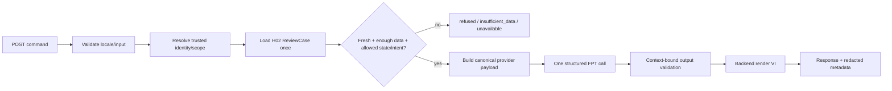

# Agent runtime integration & hardening — H23–H26

> **Owner:** Hoàng · **FR:** FR-08 · **Trạng thái:** Done (H23–H26 backend HTTP; mocked FPT)
>
> **Baseline (historical):** `T03`/`T01`/`T02` cung cấp schema/guardrail/stub/FPT adapter ở mức library. **Hiện tại:** H23 context service, H24 HTTP route, H25 structured grounding + transport harden, H26 mocked HTTP E2E + release evidence đã Done. FR-08 claimable ở **backend HTTP**; FE Agent UI và live FPT vẫn ngoài scope. **H11b closed** — docs FE/agent đồng bộ ([doc 10](10-fe-agent-integration-contract.md), [guardrails](08-agent-grounding-guardrails.md), arch §6).
>
> **Nguồn chuẩn:** [PRD §5.4 / FR-08](../02-product/04-prd.md), [Ethics §8](../02-product/05-ethics.md), [Process §3–4](../02-product/03-process.md), [system architecture §6](05-system-architecture.md), [H11a contract](10-fe-agent-integration-contract.md), [grounding/guardrails](08-agent-grounding-guardrails.md), [FPT API](01-fpt-ai-api.md).

Tài liệu này là implementation brief cho phần integration/hardening do Hoàng sở hữu. Nó không đổi công thức M02, không mở rộng dữ liệu Agent được đọc và không biến Agent thành workflow tự hành.

## 1. Outcome và ranh giới

Sau `H26`, backend phải cung cấp một vertical slice có thể kiểm chứng:

```text
HTTP command
  → server authorize/scope
  → load ReviewCase một lần
  → freshness/coverage/state/intent gate
  → tối đa một FPT structured call
  → validate output theo context
  → backend render tiếng Việt + redacted audit metadata
```

### Agent được phép

- Giải thích `review_priority_band`, contributing factor, coverage, freshness và limitation đã có trong `ReviewCase`.
- Tạo bản nháp liên hệ trung lập sau care gate, luôn `requires_human_approval=true`.
- Trả `refused`, `insufficient_data` hoặc `unavailable` trước khi gọi provider khi không đủ điều kiện.

### Agent không được phép

- Tính/sửa score, xác suất, trọng số hoặc quyết định mức ưu tiên.
- Đoán nguyên nhân cá nhân, chẩn đoán, kết luận bỏ học hoặc dùng thuộc tính audit nhóm.
- Query DWH/SQL/RAG/web, tìm case tùy ý, đọc PII/`advisor_ref` hoặc giữ session/memory.
- Gọi transition, approve/assign, send/notify/SMTP/Gmail hoặc đánh dấu “đã gửi”.
- Tự retry sang provider/dataset/scoring khác khi FPT lỗi.

`H22`/`G06` là workflow FR-12 draft theo advisor riêng. Nó không phải tool của Agent và không được nhập vào graph H23–H26.

## 2. Kiến trúc bounded DAG



Đây không phải ReAct loop. LLM không tự chọn tool; backend quyết định toàn bộ route và chỉ có tối đa một inference request sau khi mọi gate đã qua.

## 3. Public command contract

Endpoint mục tiêu:

```http
POST /review-cases/{case_id}/explanation
Content-Type: application/json

{
  "intent": "explain_case",
  "question": "Vì sao case này cần được rà soát?",
  "locale": "vi"
}
```

Public request chỉ có:

| Field | Contract |
|:--|:--|
| `case_id` | Path param; backend resolve trong server scope |
| `intent` | `explain_case \| neutral_draft` |
| `question` | UTF-8, trim, 1–500 ký tự; chỉ dùng cho local policy/normalization |
| `locale` | Literal `vi` |

`extra=forbid`. OpenAPI/request không được có `context`, `source_id`, actor/role/scope, `student_ref`, band, factor, version, `advisor_ref`, recipient hay contact.

Current MVP chỉ có trusted demo identity từ server settings, chưa phải RBAC production. H24 phải suy identity/scope phía server và ghi limitation này; không được diễn đạt thành “đã có production RBAC”.

## 4. Context và state/intent policy

Backend dựng `AgentContextResponse` từ cùng query/projection H02; browser không được gửi context. Factor code, evidence ref, coverage và version phải lấy từ `ReviewCase` đã validate.

| Điều kiện | Context/output | FPT calls |
|:--|:--|:--:|
| Fresh; band + factors hợp lệ; coverage `ok` | `ready` → giải thích | 1 tối đa |
| Fresh; coverage `partial`, vẫn có band/factors | `ready` + mirror limitation | 1 tối đa |
| Coverage `insufficient` hoặc band/factors không đủ | `insufficient_data` | 0 |
| Detail `stale` | `insufficient_data` + reason `stale_snapshot` | 0 |
| Không có case trong scope | `empty` hoặc `refused` theo policy | 0 |
| Upstream/query lỗi | `unavailable` | 0 |
| Intent/locale/input không hợp lệ | reject/refused | 0 |
| FPT timeout/401/429/malformed/oversize | `model_unavailable` | 1 tối đa |

Intent gate MVP:

- `explain_case`: cho các active state `new_signal`, `pending_review`, `approved_for_follow_up`, `assigned`, `follow_up_in_progress`, `monitoring` khi context fresh và đủ căn cứ.
- `neutral_draft`: chỉ `approved_for_follow_up` hoặc `assigned`, đồng thời mapping advisor nội bộ hợp lệ. `new_signal`, `pending_review`, `dismissed`, `resolved` hoặc mapping-repair phải refused trước FPT.
- Agent không được transition state trong bất kỳ nhánh nào.

Nếu team muốn mở rộng state cho `neutral_draft`, phải ghi decision trước khi đổi test/contract; không tự nới bằng heuristic.

## 5. Grounding và data minimization

### 5.1 Provider input

Không gửi raw `question` tới FPT. Backend map `intent` thành canonical task và chỉ gửi:

- public priority band;
- canonical factor codes;
- coverage counts/status/reason codes được phép;
- canonical limitation keys.

Không gửi `case_id`, `student_ref`, `source_id`, `advisor_ref`, actor, email/SĐT/tên/MSSV, raw DWH row, score/outcome/audit attribute, raw prompt hoặc chain-of-thought.

### 5.2 Provider output

FPT chỉ trả một plan có cấu trúc, ví dụ:

```json
{
  "template_key": "explain_review_priority",
  "used_factor_codes": ["grade_trend_declining"],
  "limitation_keys": ["attendance_partial"],
  "draft_variant_key": null
}
```

Runtime phải kiểm:

- `used_factor_codes` là subset của context factor codes;
- limitation keys là subset/mirror context limitations;
- template/draft key nằm trong allowlist theo intent;
- `model_version` trong response cuối được backend echo chính xác từ context;
- mọi fact/evidence ref trong response cuối thuộc context;
- `draft_message` chỉ tồn tại khi intent/state gate hợp lệ và luôn cần human approval.

LLM chỉ chọn cách diễn đạt trong allowlist. Backend render câu tiếng Việt từ canonical catalog; regex blacklist không được dùng làm bằng chứng duy nhất rằng prose đã grounded. `DraftMessage.channel` phải bỏ hoặc khóa `copy|mailto`; cấm giá trị `smtp`.

## 6. Provider, giới hạn và audit

- FPT client được dựng từ `Settings`; API key dùng secret field/repr-safe và không log.
- Base URL bắt buộc HTTPS và host allowlist `mkp-api.fptcloud.com` trong MVP.
- Timeout inference tối đa 30 giây; semaphore theo `MAX_CONCURRENT_AGENT_RUNS`.
- Request đặt `temperature=0`, `max_tokens<=512`; response body tối đa 16 KiB.
- JSON null/sai type, 401, 429, timeout, invalid UTF-8 hoặc response quá lớn đều map `model_unavailable`; không raw 500 và không fallback scoring/provider ẩn.
- Log chỉ gồm `run_status`, duration, provider/model, intent và safe grounding refs. Không log raw question, prompt, context, answer/draft, secret hoặc chain-of-thought. Tracing mặc định tắt.
- `context_unavailable` và `model_unavailable` phải có copy khác nhau.

Live FPT smoke không thuộc mocked gate thường ngày. Chỉ chạy khi có phê duyệt key/deploy riêng và dùng fixture pseudonymous; không đưa raw response vào repo/evidence.

## 7. Threat/acceptance matrix chung

| Probe | Expected |
|:--|:--|
| Client gửi `context`, `source_id`, factor, actor hoặc advisor | 422; field không có trong OpenAPI |
| Stale/insufficient/out-of-scope/forbidden intent | Fail closed; fake model call count = 0 |
| Question chứa email/PII | Bị reject/redact local; giá trị không xuất hiện trong provider payload |
| Tiếng Anh, tiếng Việt không dấu, Unicode confusable, prompt injection | Refused hoặc canonical intent; không bypass guard |
| Model bịa factor/evidence/version/template | Output bị reject; không trả claim đó cho client |
| FPT `choices=null`, malformed JSON, 401/429/timeout/oversize | `model_unavailable`; không exception thô |
| `neutral_draft` trước approval/mapping-repair | Refused; 0 model calls; không draft |
| Yêu cầu send/transition/recompute | Refused; không tồn tại tool/route thực thi |

## 8. Dependency graph và task briefs

```text
T02-core + H02 + M02 + H12a (Done)
                 ↓
                H23
                 ↓
                H24
                 ↓
                H25
                 ↓
                H26
                 ↓
          H11b + consumer UI riêng
```

### H23 — Server-derived context + contract reconciliation

```text
ID — Outcome: H23 — Agent context không thể bị client forge; contract/fixture khớp M02 thật.
Phase / Priority / Timebox: P2 / P0 / 3 giờ.
Owner: Hoàng.
Depends on + readiness: H11a-r, H02, M02, T02, H12a đều Done.
Read first: PRD §5.4/FR-08; Ethics §8; Process §3–4; docs 08/10/12; integration + ReviewCase schema; M02 factors/tests.
Input contract / fixture: H02 CaseDetailResponse; integration/agent_context_*.json; MODEL_VERSION/factor codes M02.
Scope: internal build_agent_context(case_id, trusted_scope); state/intent/freshness mapping; AgentCommand schema; align fixture/stub codes và version.
Do not touch: scoring formula/threshold; transition state; advisor mail/send; frontend.
Verify: real M02 → H02 → AgentContext tests; state matrix; forbidden-key scan; exact codes/version; invalid intent/locale/input.
Evidence / Done when: backend/tests/test_h23_agent_context.py + validated fixtures; diff docs/code thống nhất; mọi fail-closed branch đánh dấu không đủ điều kiện gọi provider để H24 enforce call count = 0.
```

### H24 — Agent HTTP runtime vertical slice

```text
ID — Outcome: H24 — POST explanation hoạt động từ server-derived context, không nhận context từ browser.
Phase / Priority / Timebox: P2 / P0 / 3–4 giờ.
Owner: Hoàng.
Depends on + readiness: H23 Done.
Read first: H23 handoff; H02 router/query; cases auth; config; T02 adapter/tests.
Input contract / fixture: AgentCommand H23 + internal AgentContextResponse; fake TextModel.
Scope: context service; router; settings/provider factory; mount main; state/intent/scope gate; dependency injection cho mocked model.
Do not touch: FE; scoring/transition/send; arbitrary search/RAG/SQL; production RBAC claim.
Verify: mocked endpoint happy/refused/insufficient/stale/unavailable; OpenAPI không có context/source/actor/advisor; forbidden branches model.calls=0; Ruff + targeted pytest.
Evidence / Done when: backend/tests/test_h24_agent_api.py; endpoint xuất hiện OpenAPI; missing key fail-closed; chưa deploy/claim runtime trước H25/H26.
```

### H25 — Context-bound grounding + FPT hardening

```text
ID — Outcome: H25 — Model không thể thêm claim ngoài context; provider lỗi không làm lộ dữ liệu/secret hoặc raw 500.
Phase / Priority / Timebox: P2 / P1 / 3–4 giờ.
Owner: Hoàng.
Depends on + readiness: H24 Done; T02 core giữ làm baseline.
Read first: H24 handoff; docs 01/08/12; grounded.py/fpt_client.py/config.py và tests gần nhất.
Input contract / fixture: canonical context H23; structured output schema/allowlist; FPT transport mocks.
Scope: bỏ raw question khỏi provider; structured plan + context validator + backend renderer; input/output bounds; semaphore/timeout/host/secret/error hardening; redacted metadata.
Do not touch: raw score/factor computation; provider fallback; SMTP/Gmail/transition; live call.
Verify: hallucinated refs/version/template; PII/injection/no-diacritics/English/Unicode/long input; 401/429/timeout/null/malformed/oversize; all forbidden branches zero calls.
Evidence / Done when: backend/tests/test_h25_grounding.py + test_h25_fpt_transport.py; full mocked suite xanh; no raw prompt/context/answer in logs.
```

### H26 — Runtime E2E, release gate và handoff

```text
ID — Outcome: H26 — Chứng minh backend Agent FR-08 chạy end-to-end và fail closed trên đường HTTP.
Phase / Priority / Timebox: P2 / P1 / 2–3 giờ.
Owner: Hoàng.
Depends on + readiness: H24 + H25 Done; D4a Done. Live FPT/deploy substep cần phê duyệt key và cửa sổ deploy riêng.
Read first: handoff H23–H25; deploy runbook; release evidence; H11b.
Input contract / fixture: approved pseudonymous domain fixture; fake FPT normal gate; live key chỉ khi authorized.
Scope: M02 → H02 → AgentContext → fake FPT → HTTP E2E; OpenAPI/health; redacted logging check; full verify; runtime limitation/handoff.
Do not touch: raw production data; auto-send; hidden live eval; frontend lane.
Verify: targeted E2E + adversarial + provider transport; scripts/verify.ps1; git diff --check; optional authorized live smoke happy + FPT-off unavailable.
Evidence / Done when: exact test counts/commands, API response/status screenshots or redacted output path, no PII/secret; H11b unblocked. Agent UI vẫn là consumer task riêng nếu cần demo qua FE.
```

## 9. Release/claim gate

`H26` **Done** (18/7): được claim “Agent grounded chạy end-to-end **qua backend HTTP**” với FakeModel / mocked transport. Evidence: [07-release-evidence §5c](../03-project/07-release-evidence.md), `backend/tests/test_h26_agent_e2e.py`. Live FPT smoke vẫn SKIP trừ khi có phê duyệt key/deploy riêng.

Backend runtime Done **không** đồng nghĩa UI Done hay production RBAC. Demo hỏi Agent từ case page cần consumer FE riêng + `H11b` sau `G05`; không coi Swagger là UX hoàn chỉnh.
