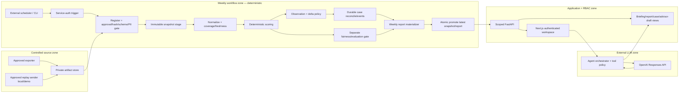

# Kiến trúc đích — snapshot tuần, workflow DAG và Global Agent

> **Trạng thái:** Backend wave H28a–D6 landed (library + APIs); FE Global Agent/weekly UI (`G07–G09`) và live EventBridge chưa ship — không claim demo Live URL nộp bài.
> **Owner kiến trúc:** Hoàng · **Task brief:** `H28` · **Liên quan:** FR-01–FR-08, FR-12  
> **Quyết định provider:** OpenAI là provider đích theo [Decision #22](../03-project/04-decisions.md); `H29` đã wire runtime (FPT inactive). Combined linked-namespace feed vẫn Mode B ([Decision #23](../03-project/04-decisions.md)).

Tài liệu này chuyển mô tả sản phẩm “robot xuất hiện sau đăng nhập, báo tình hình tuần và dẫn tới các công cụ” thành kiến trúc có thể triển khai. Nó bổ sung, không thay thế, [PRD](../02-product/04-prd.md), [Process](../02-product/03-process.md), [Ethics](../02-product/05-ethics.md), [BRD](../02-product/08-brd.md) và contract Data-ML hiện hành.

## 0. Task brief

```text
H28 — Outcome: khóa kiến trúc đích cho feed snapshot tuần, báo cáo/delta bền vững và Agent toàn cục dùng OpenAI.
Phase / Priority / Timebox: kiến trúc trước build / P0 / 1 ngày tài liệu + review.
Owner: Hoàng; Product owner duyệt semantics delta, export và email; Data owner duyệt chuỗi snapshot.
Depends on + readiness: H19–H26 Done ở scope cũ; production auth/RBAC và chuỗi snapshot tuần chưa sẵn sàng.
Read first: PRD §§5–8; Process §§3–6; Ethics §§3–8; BRD §§8–9; docs 05/07/08/10/11/12.
Input contract / fixture: snapshot pseudonymous đã duyệt; không tạo quan sát sinh viên giả để bù nguồn thiếu.
Scope: kiến trúc, contract, backlog, acceptance; không đổi scoring/case state và chưa gọi provider thật.
Do not touch: dữ liệu PII/raw, auto-send, bulk export định danh, heuristic “sinh viên mới”.
Verify: link local, traceability, review current-vs-target, Quick verify, git diff --check.
Evidence / Done when: owner có thể giao từng task build mà không cần tự đoán provider, dữ liệu, quyền hay failure semantics.
```

## 1. Kết luận kiến trúc

Ba hệ thống con phải độc lập:

```text
Weekly data workflow     tạo snapshot, observation, delta, case và báo cáo có version
Application services     áp RBAC/scope, phục vụ report/case/advisor draft
Global Agent workspace   hiển thị briefing, điều hướng và giải thích artifact đã khóa
```

OpenAI chỉ tham gia lớp cuối. Nếu OpenAI timeout, hết quota hoặc bị tắt, workflow tuần, báo cáo, danh sách case và các action card vẫn phải hoạt động.

“Robot humanoid” là **điểm vào UI**, không phải một actor tự hành. Nó không được chạy DAG, tự chọn sinh viên, tính `newly_detected`, approve/assign case hay gửi thông báo.

## 2. Hiện trạng và khoảng cách tới đích

| Capability | Hiện trạng repo 18/7/2026 | Kiến trúc đích |
|:--|:--|:--|
| LLM provider | Runtime chỉ đọc `FPT_*` và dựng `FPTChatClient`; `OPENAI_API_KEY` có trong `.env.example` nhưng chưa được Settings/runtime sử dụng | Backend dùng OpenAI Responses API qua adapter provider-neutral; không fallback FPT ẩn |
| Agent backend | Một bounded explanation call cho một `ReviewCase`; FakeModel/mocked transport là evidence chính | Giữ explanation hiện có, thêm tool registry read/navigation có schema và scope server-side |
| Agent frontend | `AgentPanel` đã có trên trang chi tiết case cục bộ; chưa có shell toàn cục | Một Agent drawer duy nhất trong authenticated layout, có mặt ở mọi trang sau đăng nhập |
| Snapshot | Import bằng CLI; `source_id` là khóa chính và chỉ chấp nhận một hash | Snapshot immutable, nhiều phiên bản, có lineage và active pointer |
| Trigger tuần | Không scheduler, run ledger, retry/replay hay publish transaction | External scheduler gọi cùng một `WeeklyWorkflowService` mà CLI mock dùng |
| Case/delta | `/review-cases` tính khi GET; case store nằm RAM; chưa có observation/delta | Case/event bền vững; GET read-only; delta so với lần chạy thành công trước |
| Báo cáo/briefing | Chưa có weekly report hoặc receipt “đã hiện một lần” | Report materialized + briefing theo role/scope + receipt theo user/report |
| Advisor mail | Backend có draft-only API; chưa có `/notify` hoàn chỉnh và không có send | Trang `/notify` lọc/group/preview, Copy/`mailto:` sau human approval; vẫn không có send endpoint |
| Identity/scope | Demo identity và client-side role guard; chưa phải RBAC production | Backend suy actor, role, org/advisor scope; negative authorization tests |

### 2.1 Các blocker không thể giải quyết bằng cách chỉ thêm cron

1. `dwh.source_manifest.source_id` hiện là PK; cùng nguồn nhưng hash tuần mới bị coi là conflict. Domain rows cũng khóa theo `source_id`, nên chưa lưu được lịch sử tuần.
2. Source approval, ID và hash đang gắn cứng với importer/allowlist. Feed mới hiện là thay code, chưa phải một input vận hành.
3. Semester và attendance fixture hiện không có `student_ref` giao nhau. Chưa thể claim một báo cáo tổng hợp điểm + chuyên cần + advisor từ hai nguồn này.
4. Case được tạo trong lúc đọc API và lưu RAM; không có nền bền vững để biết case nào “mới”, “đang tiếp diễn” hay “xuất hiện lại”.
5. Freshness hiện có đường lấy từ thời điểm tính lúc GET. Kiến trúc tuần phải lấy độ mới từ `extracted_at` của snapshot, không làm nguồn cũ trông như vừa cập nhật.
6. Ngưỡng hiện còn trạng thái `uncalibrated`; báo cáo demo không được diễn đạt thành hiệu quả vận hành thực tế.

## 3. Sơ đồ đích



Không có đường `OpenAI → DWH`, `OpenAI → scheduler`, `OpenAI → case transition` hoặc `OpenAI → mail sender`.

## 4. Snapshot v2 và mock feed tuần

### 4.1 Canonical snapshot manifest

Một snapshot là artifact immutable, không phải “nội dung mới nhất” bị overwrite:

```json
{
  "contract_version": "weekly-snapshot-v2",
  "dataset_key": "epu-care-signals",
  "snapshot_id": "<content-addressed-id>",
  "previous_snapshot_id": "<nullable-id>",
  "supersedes_snapshot_id": null,
  "period_start": "2026-07-13",
  "period_end": "2026-07-19",
  "extracted_at": "<source timestamp>",
  "delivered_at": "<transport timestamp>",
  "schema_version": "<domain schema version>",
  "pseudonym_namespace_version": "<approved namespace>",
  "source_snapshot_sha256": "<64 hex>",
  "normalized_artifact_sha256": "<64 hex>",
  "dataset_content_sha256": "<64 hex>",
  "approval_id": "<external approval handle>",
  "provenance_approved": true,
  "fixture_mode": "none",
  "row_counts": {},
  "quality_reason_codes": []
}
```

Contract bắt buộc:

- `snapshot_id` là identity immutable; `dataset_key` là tên nguồn logic ổn định. Không dùng một field cho cả hai nghĩa.
- Tách hash bytes nguồn, artifact normalize và nội dung dataset; không đổi nghĩa hash giữa các stage.
- Correction cùng kỳ phải có `supersedes_snapshot_id` và approval mới; không overwrite run/report cũ.
- `extracted_at` quyết định freshness; `delivered_at` chỉ đo vận chuyển.
- Semester, attendance và advisor mapping phải dùng cùng `pseudonym_namespace_version` trong một canonical bundle được duyệt. Ứng dụng không tự đoán join giữa hai source.
- Scheduler event chỉ mang `manifest_ref`, hash và idempotency key; không mang row sinh viên.

### 4.2 Cách mock an toàn

| Phase | Input | Chứng minh được | Không được claim |
|:--|:--|:--|:--|
| A — approved replay | Phát lại **đúng bytes** package pseudonymous đã duyệt | Schedule, gate, idempotency, no-change report, failure/replay | Có sinh viên mới hoặc feed EPU thật |
| B — approved as-of replay | Cắt lịch sử theo `term_code` / `observed_at` từ artifact đã duyệt; không sửa điểm, thời gian hoặc tạo ID | Delta tuần trên các quan sát đã tồn tại | Combined điểm + attendance nếu namespace chưa liên kết |
| C — approved linked sequence | Tối thiểu hai canonical bundle tuần liên tiếp do data owner duyệt | `newly_detected`, ongoing, changed, resurfaced và advisor grouping end-to-end | Hiệu quả production nếu đây chỉ là demo replay |
| D — negative package | Manifest/hash/schema sai, không chứa dữ liệu thật | Fail-closed và giữ latest report cũ | Một lần chạy thành công |

Fixture unit test tối thiểu có thể kiểm contract/delta trong `backend/tests/fixtures/weekly/`, nhưng không được đưa vào production allowlist hay dùng làm evidence rằng trường đã gửi feed thật.

Không tự tăng `extracted_at`, thêm attendance event, sửa điểm hoặc tạo sinh viên để làm demo “trông mới”. Cho tới khi có chuỗi snapshot được duyệt, demo trung thực nhất là **approved replay + không có tín hiệu mới**.

### 4.3 Trigger mock đề xuất

Một service duy nhất, hai adapter:

```text
python -m app.workflows.weekly run --manifest-ref <private-or-approved-path>
                                      │
                                      └── WeeklyWorkflowService.run(...)
                                                         ▲
AWS EventBridge / cron nội bộ → queue/worker ─────────────┘
```

- MVP local dùng CLI và script PowerShell gọi CLI; không tạo public upload endpoint.
- Deploy dùng scheduler ngoài FastAPI process. Không nhúng APScheduler vào web process vì restart/multi-instance có thể chạy trùng.
- Nếu cần HTTP nội bộ, chỉ có `POST /internal/workflow-runs`, service-auth, event chỉ chứa artifact reference. Route bị tắt khỏi public ingress.
- OpenAI background mode không phải scheduler nghiệp vụ tuần; model call không nằm trong DAG này.

## 5. Weekly workflow, idempotency và failure semantics

### 5.1 Các step

```text
register
→ validate approval/hash/schema/PII/counts/quality
→ stage immutable snapshot
→ normalize + coverage/freshness
→ deterministic score
→ materialize signal observations
→ run fairness/evaluation gate tách biệt khi đủ nhóm audit, ground truth và cỡ mẫu; nếu thiếu thì materialize `insufficient_data`
→ compare previous successful promoted snapshot
→ reconcile durable cases/events
→ materialize weekly report + advisor-draft input
→ atomically promote active snapshot + latest report
→ publish role-scoped briefing
```

`workflow_run.status` dùng các trạng thái `queued`, `validating`, `staging`, `scoring`, `reconciling`, `reporting`, `publishing`, `succeeded`, `failed`, `duplicate`.

### 5.2 Transaction và replay

- Idempotency key: `(dataset_content_sha256, workflow_version, model_version, threshold_config_version)`.
- Khóa đồng thời theo `dataset_key`; hai trigger cùng input trả cùng run hoặc một run là `duplicate`.
- Stage có thể hoàn tất trước, nhưng `active_snapshot` và `latest_report` chỉ đổi cùng một transaction cuối.
- Fail ở bất kỳ step nào không tạo report/case effect công khai và không thay latest pointer. UI tiếp tục phục vụ báo cáo thành công trước, kèm stale/sync-failed banner.
- Replay run lỗi ghi `replay_of_run_id`; không xóa lịch sử lỗi.
- Recompute vì code/model/threshold đổi có lineage riêng và không được gọi là “tuần mới” nếu dữ liệu không đổi.
- Unique effect keys chặn trùng observation, case event, report và briefing receipt.

## 6. Persistence cần bổ sung

| Object | Trách nhiệm chính |
|:--|:--|
| `dataset_source` | Registry cho `dataset_key`, source owner, usage/retention policy và allowlist |
| `dataset_snapshot` | Version immutable, hashes, period, approval, quality, lineage/correction |
| Domain rows v2 | PK/FK theo `snapshot_id + student_ref`; cùng namespace trong bundle |
| `active_dataset_snapshot` | Pointer atomic tới snapshot đã promote gần nhất |
| `workflow_run` / `workflow_step_run` | Trigger, versions, status, attempt, failure stage/reasons và timings |
| `signal_observation` | Output immutable theo run/student: band, factors, coverage, versions và evidence fingerprint an toàn |
| `review_case` / `case_event` | Case episode bền vững và history append-only; state do người/Process quyết định |
| `weekly_report` / `weekly_report_item` | Aggregate + scoped rows + delta type + comparison lineage |
| `agent_briefing` / `briefing_receipt` | Message aggregate và `shown_at`/`acknowledged_at` theo user + role + report |
| `agent_tool_run` | Audit metadata tối thiểu; không raw prompt, context, draft hoặc PII |

Migration phải giữ snapshot hiện tại như version đầu tiên. Không đổi `source_id` thành weekly ID bằng nối chuỗi tùy ý vì allowlist, FK và source meaning sẽ tiếp tục bị trộn.

Case ID phải là opaque episode ID, không cố định `rc-{student_ref}`. Một partial unique constraint chỉ cho phép một active episode theo `student_ref + scope + signal_family`; episode mới sau terminal case cần policy “thay đổi đủ ý nghĩa” được version hóa và Product owner duyệt.

## 7. Semantics “sinh viên mới cần quan tâm”

`newly_detected` là thuộc tính của **report item/detection**, không phải case state và không phải nhãn của sinh viên.

### 7.1 Điều kiện eligible

Một observation chỉ eligible khi source được duyệt và còn fresh, coverage không `insufficient`, band/factors hợp lệ và versions được ghi đủ. LLM không quyết định điều kiện này.

### 7.2 Delta matrix

| Previous successful comparable run | Current run | `delta_type` | Case effect |
|:--|:--|:--|:--|
| Không có baseline | Eligible | `initial_baseline` | Tạo/giữ case theo policy, **không** đánh dấu toàn bộ là mới |
| Không eligible | Eligible; không có active/suppressed episode | `newly_detected` | Mở candidate/episode theo deterministic policy |
| Eligible | Eligible; fingerprint không đổi | `ongoing` | Giữ case/state hiện tại |
| Eligible | Eligible; band/factor fingerprint đổi đủ điều kiện | `changed` | Thêm observation/event; không tự đổi care state |
| Eligible | Không eligible | `no_longer_detected` | Không tự dismiss/resolve case |
| Terminal episode trước đó | Eligible trở lại | `resurfaced` | Chỉ mở episode mới khi significant-change policy đạt |
| Model/threshold/namespace không comparable | Bất kỳ | `comparison_unavailable` | Không claim mới; nêu reason code |

Để so delta dữ liệu, previous và current phải được tính với cùng `model_version` và `threshold_config_version`. Khi version đổi, re-score cả hai hoặc trả `comparison_unavailable(version_changed)`.

## 8. Weekly report và API

### 8.1 Report contract tối thiểu

`WeeklyReport` mang:

- `report_id`, `run_id`, `period_start/end`, `generated_at`;
- current/comparison snapshot IDs và `comparison_status`;
- `model_version`, `threshold_config_version`, `workflow_version`;
- aggregate counts: eligible, initial baseline, newly detected, ongoing, changed, resurfaced, no-longer-detected, overdue và insufficient;
- source freshness/coverage, quality/fairness state và limitations;
- scoped `WeeklyReportItem` gồm opaque case/student reference được phép, band, safe factors, case state và `delta_type`.

### 8.2 Business surfaces

```http
GET /weekly-reports/latest
GET /weekly-reports/{report_id}
GET /weekly-reports/{report_id}/students?delta_type=newly_detected
GET /me/agent-briefings/latest
POST /me/agent-briefings/{briefing_id}/shown
POST /me/agent-briefings/{briefing_id}/acknowledge
GET /advisor-handoff-drafts?report_id={report_id}
POST /agent/turns
```

Tất cả scope do backend suy từ session. GVCN không được gửi `advisor_ref` hay `source_id` để mở rộng scope; Ban quản lý có filter hợp lệ nhưng backend vẫn áp organization scope.

### 8.3 Giới hạn export

Mô tả “báo cáo tổng thể gồm toàn bộ sinh viên” được hiện thực hóa bằng **danh sách xem trong hệ thống**. Theo [BRD §9](../02-product/08-brd.md), không có bulk export định danh:

- export tổng thể chỉ là aggregate không định danh;
- export chi tiết chỉ từng case, có watermark người xuất + thời điểm và access-audit;
- global Agent không có tool tạo file chứa toàn bộ `student_ref`.

Nếu Product owner muốn thay giới hạn này, phải sửa BRD/Ethics, threat model và access-audit contract trước build; không nới bằng UI shortcut.

## 9. Global Agent workspace

### 9.1 Vị trí trong frontend

Target route structure:

```text
app/(public)/login
app/(public)/select-role
app/(authenticated)/layout.tsx
  dashboard
  cases/[caseId]
  reports/weekly/[reportId]
  notify
  my-class
```

`(authenticated)/layout.tsx` chứa `AuthenticatedShell`, `GlobalAgentProvider`, `AgentLauncher`, `WeeklyBriefingBubble` và `AgentDrawer`. Đây là cách bảo đảm Agent có mặt trên mọi page sau đăng nhập; đặt riêng trong `AppShell` hiện tại là chưa đủ vì trang chi tiết case không dùng `AppShell`.

`AgentPanel` hiện tại được giữ trong migration, sau đó chuyển capability giải thích case vào drawer để tránh hai Agent khác nhau trên cùng sản phẩm.

### 9.2 Một thông báo duy nhất mỗi tuần

Sau login và chọn role:

1. UI gọi `GET /me/agent-briefings/latest`.
2. Backend trả briefing aggregate theo role/scope và danh sách action IDs được phép.
3. UI chỉ tự mở khi chưa có receipt `(user_id, role, briefing_id)`; ghi `shown_at` nguyên tử phía server.
4. Điều hướng page không hiện lại. Người dùng vẫn có thể mở lịch sử bằng nút robot.
5. Đổi role xóa transient context và tải briefing/permissions mới.

Briefing v1 render deterministic từ `WeeklyReport`, ví dụ:

> Tuần 13–19/7: có 9 tín hiệu mới cần rà soát, 14 case đang chờ duyệt và 3 case quá hạn. Dữ liệu chuyên cần đang ở trạng thái một phần; xem giới hạn trước khi xử lý.

OpenAI không cần thiết để tạo fact trên. Nếu workflow fail/stale, message phải nêu lần thành công gần nhất và disable action phụ thuộc report mới; không diễn đạt “không có vấn đề”.

### 9.3 Interaction và accessibility

- Robot là avatar trang trí; control thực là button có label “Trợ lý AI — chỉ giải thích dữ liệu”.
- Không tự phát âm, không modal chặn màn hình, không animation liên tục; hỗ trợ `Escape`, focus return, keyboard tương đương chuột, `aria-live="polite"` và `prefers-reduced-motion`.
- Page chỉ đăng ký `{surface, resource_handle}`. Browser không gửi raw case, student data hay prompt context; backend authorize và load lại resource.
- Khi route/case/role đổi, xóa transient context để tránh rò dữ liệu giữa hai case.

## 10. Tool registry và quyền

MVP ưu tiên **capability cards do backend cấp**, không để model tự do khám phá tool.

| Capability ID | Ban quản lý | GVCN | Executor / effect |
|:--|:--:|:--:|:--|
| `view_weekly_briefing` | Toàn scope được cấp | Aggregate case đã giao | Report service, read-only |
| `open_weekly_report` | Danh sách trong app | Không có full organization list | Client navigate bằng route allowlist |
| `filter_new_detections` | Có | Chỉ case được giao | Scoped report/case query |
| `open_case_analysis` | Case trong scope | Chỉ case đã giao | Navigate `/cases/{case_id}` |
| `explain_case` | Có | Có trong scope | Existing grounded explanation; read-only |
| `open_advisor_drafts` | Có | Không | Navigate `/notify?report_id=…` |
| `preview_advisor_drafts` | Case approved/assigned hợp lệ | Không | Deterministic H22-style draft; no send |
| `copy_draft` / `open_mail_client` | Người dùng bấm sau preview | Không | Browser Copy/`mailto:`; không ghi “đã gửi” |
| `approve/assign/transition` | Không phải Agent tool | Không phải Agent tool | Care UI/API riêng, human action |
| `run_workflow` / `send_mail` | Không | Không | Không tồn tại trong Agent registry |

Tool schema không nhận actor, role, organization, `advisor_ref`, `source_id`, raw URL hay arbitrary SQL. Backend tự suy scope và trả `ui_action.route_key` từ allowlist thay vì để model tạo URL.

## 11. OpenAI Agent runtime đích

### 11.1 Provider migration

1. Tách `TextModel`/`ModelUnavailable` khỏi `fpt_client.py` sang interface provider-neutral; giữ FakeModel tests.
2. Thêm `OpenAIResponsesClient`; Settings/runtime chỉ đọc secret server-side `OPENAI_API_KEY` và model đã được eval/pin.
3. Chỉ cho phép official OpenAI endpoint; không có automatic FPT/OpenAI fallback.
4. Gửi safe projection tối thiểu, `store: false`, timeout có bound và không automatic provider retry trong một agent turn.
5. Structured Outputs bảo đảm shape; semantic allowlist/subset validation hiện có vẫn bắt buộc để chặn factor/evidence bịa.
6. Live OpenAI smoke là opt-in với fixture pseudonymous và evidence redact; mocked/adversarial suite vẫn là release gate hằng ngày.

OpenAI mô tả function calling là cầu nối giữa model với tool/data của ứng dụng; với MVP dùng strict JSON schema, `additionalProperties: false` và `parallel_tool_calls: false` để mỗi turn có tối đa một tool decision. Xem [Function calling](https://developers.openai.com/api/docs/guides/function-calling) và [Structured Outputs](https://developers.openai.com/api/docs/guides/structured-outputs).

API data không được dùng để huấn luyện theo mặc định, nhưng abuse-monitoring/application state có retention mặc định tùy endpoint. Vì đây là dữ liệu giáo dục nhạy cảm, runtime phải dùng `store: false`, chỉ gửi projection pseudonymous và giữ conversation state tối thiểu trong ứng dụng theo retention policy được duyệt. Xem [Data controls](https://developers.openai.com/api/docs/guides/your-data).

Adversarial/red-team tests và human review trước hành động thực tế là release gate, không phải mục hậu kiểm tùy chọn; xem [OpenAI safety best practices](https://developers.openai.com/api/docs/guides/safety-best-practices) và ranh giới chặt hơn trong Ethics của dự án.

### 11.2 Agent turn contract

Request public tối thiểu:

```json
{
  "message": "Cho tôi xem các tín hiệu mới tuần này",
  "locale": "vi",
  "page_context": {
    "surface": "dashboard",
    "resource_handle": null
  }
}
```

Server thực hiện:

```text
authenticate → resolve role/scope → input guard → resolve safe page context
→ derive allowed capability IDs → optional one OpenAI tool decision
→ execute one read/draft-preview tool → semantic output guard
→ return controlled copy + evidence refs + allowlisted UI action
```

Response:

```json
{
  "status": "ok",
  "message_vi": "Có 9 tín hiệu mới trong báo cáo tuần đã khóa.",
  "evidence_refs": [{"kind": "weekly_report", "handle": "<report-id>"}],
  "cards": [{"capability_id": "filter_new_detections", "label_vi": "Xem 9 tín hiệu mới"}],
  "ui_action": null,
  "requires_human_approval": false,
  "limitations_vi": null
}
```

Không dùng OpenAI Conversations persistence ở phase đầu. Ứng dụng giữ state theo session ngắn, không memory xuyên case; route/role change reset context. Long-running weekly processing thuộc workflow worker, không dùng model background task.

## 12. Notify page và mail draft

`/notify` là workflow ứng dụng, không phải email agent tự hành:

```text
weekly report
→ chỉ case approved/assigned + mapping hợp lệ
→ group theo advisor_ref trong server scope
→ preview danh sách pseudonymous + controlled draft
→ human review
→ Copy hoặc mở mail client
```

Yêu cầu:

- bucket `mapping_repair` rõ ràng; không bỏ im case thiếu advisor;
- không trả email/SĐT/họ tên trong API public;
- `requires_human_approval=true` bất biến;
- không tự chọn recipient, không SMTP/Gmail/Outlook tool, không đánh dấu “đã gửi”;
- access audit cho view/preview/copy/mailto metadata an toàn, không lưu raw draft.

Muốn hệ thống gửi email thật là một scope/decision khác: cần contact vault, consent/purpose, recipient verification, delivery audit, retry/incident handling và owner phê duyệt. Nó không được suy ra từ yêu cầu “soạn mail”.

## 13. Failure, security và observability

| Failure / threat | Hành vi bắt buộc |
|:--|:--|
| Snapshot/hash/approval/schema/PII fail | Không promote, không tạo detection/report mới; ghi reason code |
| Workflow fail giữa chừng | Latest pointer giữ run thành công trước; UI báo stale/sync failed |
| Duplicate/concurrent trigger | Một effect duy nhất; run còn lại `duplicate`/no-op |
| Baseline/model/threshold không comparable | `comparison_unavailable`; không đánh dấu “mới” |
| OpenAI timeout/401/429/malformed | Agent `unavailable`; report/case/navigation vẫn dùng được |
| Prompt injection/PII/out-of-scope | Refuse trước provider hoặc zero tool effect |
| Tool args cố mở scope/raw URL | Schema reject; backend không tin client/model actor/scope |
| Advisor mapping thiếu | Không draft/handoff; đưa mapping-repair bucket |
| Yêu cầu send/transition/recompute | Refuse; capability không tồn tại |

Metrics/log chỉ giữ run/step duration, counts, version, stale age, provider status và reason codes. Không log rows, `student_ref`, raw question/context/answer/draft, secret hay chain-of-thought. Cần kill switch riêng cho ingestion, case materialization, briefing publish và OpenAI calls.

## 14. Backlog theo dependency

Sprint là nguồn chuẩn owner/status. Hoàng sở hữu `H28`, `H28a`, `H29–H38` và `D6` trong phạm vi backend/docs/security/deploy; task brief đầy đủ tại [Stories — Hoàng](../03-project/17-stories-hoang-weekly-agent.md). `G07–G09` và `T05` vẫn là consumer lanes riêng.

| ID | Outcome | Depends on | Evidence tối thiểu |
|:--|:--|:--|:--|
| `H28a` | Readiness/decision lock: delta, linked namespace, identity, retention, scheduler | H28 | Decision/approval handles; không raw PII; downstream có task-ID dependency |
| `H29` | Decision/config/provider-neutral interface + OpenAI Responses adapter | H28 | Mocked transport, missing-key zero call, `store:false`, strict schema, timeout/429/malformed |
| `H30` | Snapshot v2 registry + Alembic run/step ledger + active pointer | H28a + H19 | Multi-version/idempotency/correction migration tests |
| `H31` | Importer stage/promote + CLI mock sender | H30 + H20 | Exact-byte replay, concurrent duplicate, atomic failure/replay |
| `H32` | Canonical linked bundle/adapter + immutable observations | H31 + H28a | Hash/count/PII/coverage/freshness/determinism tests |
| `H33a` | Durable case/event persistence; GET read-only | H32 + H06b | Migration/concurrency/transition regression; no GET mutation |
| `H33b` | Deterministic delta/reconcile engine | H33a + H28a | Full delta matrix; preserve human state; no auto-close |
| `H36` | Production identity/RBAC/scope + access-audit foundation | H28a + H06b | Cross-scope negative tests; server-derived actor/source/advisor |
| `H34a` | Weekly report materializer + scoped APIs | H33b + H36 | Exact aggregates, scope negative tests, stale/failed states |
| `H34b` | Deterministic briefing + one-time receipt APIs | H34a + H36 | Role-scoped copy, concurrent receipt dedupe, provider independence |
| `H35` | Advisor draft API trên durable approved cases/report | H34a + H36 + H22 | Mapping-repair, server scope, no send/public contacts |
| `H37` | Global Agent backend turn + strict capability registry | H29 + H34b + H35 + H36 | One-tool bound, evidence refs, zero forbidden effects |
| `H38` | Safe aggregate/per-case export + watermark/audit | H34a + H36 | No bulk identifiers; cross-scope deny; export audit |
| `G07` | Authenticated route layout + global Agent shell | H36 | All protected pages; route/role reset; accessibility |
| `G08` | Weekly briefing, report view/new badges, deep links | H34b + G07 | ok/empty/stale/failed/baseline-missing E2E |
| `G09` | `/notify` advisor filter/preview/Copy/`mailto:` | H35 + G07 | Human preview; no SMTP; negative scope tests |
| `T05` | Agent tool/RBAC/adversarial/e2e matrix | H29 + H34b + H37 + G07 | Injection, PII, forbidden tool, provider-down independence |
| `D6` | Scheduler/worker deploy, observability, retention, rollback | H31 + H34b + H35 + H37 + H38 | Scheduled dry run, replay, kill switches, redacted evidence; T05 là cross-lane QA bổ sung |

### 14.1 Thứ tự vertical slice khuyến nghị

```text
Slice 0: H28a ∥ H29
  Khóa input/permission/scheduler decisions; migration OpenAI độc lập với data DAG.

Slice 1: H30 → H31
  Approved replay chạy qua CLI, có ledger/idempotency; chưa cần UI/LLM.

Slice 2: H32 → H33a → H33b; H36 chạy song song → H34a → H34b
  Hai snapshot đã duyệt tạo delta/report/briefing deterministic, case bền vững và scope server-side.

Slice 3: G07 → G08
  Robot toàn cục hiện một briefing và ba action card; chưa cần free-form chat.

Slice 4: H29 + H34b + H35 + H36 → H37 → T05
  OpenAI giải thích/route bounded trên artifact đã khóa; không có action write/send.

Slice 5: H38 ∥ (H35 → G09) → D6
  Export an toàn, Notify draft-only và scheduler production hardening.
```

Global shell không nên block việc sửa persistence/data pipeline. Ngược lại, tool chat free-form bị block cho tới khi RBAC, report handles và safe tool schemas hoàn tất.

## 15. Acceptance matrix

| Kịch bản | Expected |
|:--|:--|
| Replay cùng approved artifact hai lần | Một succeeded report; lần sau duplicate/no notification |
| Run đầu không có baseline | `initial_baseline`; không gắn mọi row là mới |
| Snapshot tuần kế tiếp có approved new observation | Report đánh `newly_detected`; case episode/state đúng policy |
| Observation biến mất | `no_longer_detected`; không tự resolve/dismiss |
| Version đổi, không có comparable baseline | Không claim mới; reason `version_changed` |
| Workflow fail sau scoring | Không promote snapshot/report/case effect |
| User login/navigate nhiều page | Briefing tự hiện một lần; robot vẫn mở lại được |
| GVCN thử xem full report/case khác scope | 403/empty theo policy; không lộ existence/data |
| Agent được hỏi chạy DAG/gửi mail/đổi state | Refused; zero forbidden effect |
| OpenAI bị tắt | Briefing/report/navigation/draft deterministic vẫn hoạt động |
| Ban quản lý muốn “xuất toàn bộ danh sách” | Chỉ view trong app; export aggregate hoặc per-student có watermark/audit |

## 16. Readiness decisions (H28a — locked)

Các mục dưới đây đã chốt trong [Decision #23](../03-project/04-decisions.md). Build `H30+` chỉ được dùng các handle này; không tự mở rộng.

1. **Significant-change / resurfaced:** đổi `review_priority_band` hoặc set `contributing_factor` codes sau terminal → được mở episode mới; `no_longer_detected` không auto-close; version/namespace không comparable → `comparison_unavailable`.
2. **Linked namespace:** chưa có canonical linked bundle → **Mode B** (tách nhánh điểm / chuyên cần). Handle hiện tại: `approval:pending-linked-namespace`. Combined feed chỉ sau approval handle không-PII từ data owner.
3. **Identity/RBAC/retention:** server principal from cookie session — `actor_id` / `active_role` ∈ {`ban_quan_ly`,`gvcn`} / `org_scope` / `advisor_scope`; client role không SoT; receipt/audit metadata 90 ngày (`app.access_audit_event`), không raw prompt/PII. Worker/CLI ≠ human role.
4. **Scheduler:** EventBridge → SQS (hoặc approved cron host) → worker gọi cùng `WeeklyWorkflowService`; cấm APScheduler trong FastAPI process.
5. **OpenAI model pin:** `OPENAI_MODEL` env (pin sau mocked `H29`); `store=false`; không “latest”.
6. **Email:** Decision #20 draft-only; delivery = out of scope.
