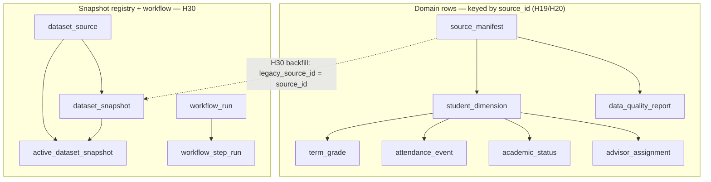

# Database schema & ERD — Silent Shield MVP

> **Trạng thái:** SoT vật lý cho PostgreSQL schema `dwh` tại thời điểm migrations `20260718_h19_dwh` → `20260718_h30_snapshot`.
>
> **Nguồn code:** `backend/app/dwh/models.py` · **Migrations:** `backend/alembic/versions/` · **Thiết kế/import gate:** [07-mvp-persistence-schema](07-mvp-persistence-schema.md).
>
> Khi prose và ORM lệch nhau, ưu tiên migration đã apply + models; cập nhật tài liệu này trong cùng handoff.

## 1. Phạm vi

| Có trong Postgres `dwh` | Chưa có bảng Postgres (in-memory / process-local) |
|:--|:--|
| Domain snapshot (điểm, điểm danh, advisor, quality) | Care `ReviewCase` / `CaseStore` (`app.cases.store`) |
| Snapshot registry H30 (`dataset_*`, `active_dataset_snapshot`) | Weekly durable cases/events H33a (`app.weekly.cases_durable`) |
| Workflow ledger H30 (`workflow_run`, `workflow_step_run`) | Weekly report / briefing / receipts (`app.weekly.state`) |
| | Agent session / audit log demo |

Engine: **PostgreSQL** qua `DATABASE_URL` (`postgresql+psycopg://…`). Alembic version table nằm trong schema `dwh`. Public API/UI/agent **không** query trực tiếp `dwh`; đọc qua H08 adapter và projection an toàn.

## 2. ERD tổng quan

```mermaid
erDiagram
  source_manifest ||--o{ student_dimension : "source_id"
  source_manifest ||--o{ data_quality_report : "source_id"
  student_dimension ||--o{ term_grade : "source_id+student_ref"
  student_dimension ||--o{ attendance_event : "source_id+student_ref"
  student_dimension ||--o{ academic_status : "source_id+student_ref"
  student_dimension ||--o{ advisor_assignment : "source_id+student_ref"

  dataset_source ||--o{ dataset_snapshot : "dataset_key"
  dataset_source ||--|| active_dataset_snapshot : "dataset_key"
  dataset_snapshot ||--o| active_dataset_snapshot : "snapshot_id"
  workflow_run ||--o{ workflow_step_run : "run_id"

  source_manifest {
    string source_id PK
    string snapshot_sha256 UK
    bool provenance_approved
    string schema_version
    int record_count
    timestamptz extracted_at
  }

  student_dimension {
    string source_id PK_FK
    string student_ref PK
    string cohort
    string department
    string program
    string major
    string class_code
  }

  term_grade {
    string source_id PK_FK
    string student_ref PK_FK
    string term_code PK
    string course_ref PK
    numeric credits
    numeric final_grade
    string grade_status
  }

  attendance_event {
    string source_id PK_FK
    string student_ref PK_FK
    timestamptz observed_at PK
    string course_ref PK
    string presence_status
    bool excused
  }

  academic_status {
    string source_id PK_FK
    string student_ref PK_FK
    string status_code
    timestamptz status_observed_at
    string is_dropout_outcome
  }

  advisor_assignment {
    string source_id PK_FK
    string student_ref PK_FK
    string advisor_ref
    string scope_source
  }

  data_quality_report {
    int report_id PK
    string source_id FK
    string report_version
    timestamptz generated_at
    int row_count
    int reject_count
  }

  dataset_source {
    string dataset_key PK
    string source_owner
    string retention_policy
    text usage_notes
  }

  dataset_snapshot {
    string snapshot_id PK
    string dataset_key FK
    string dataset_content_sha256
    string legacy_source_id
    string status
  }

  active_dataset_snapshot {
    string dataset_key PK_FK
    string snapshot_id FK
    timestamptz promoted_at
  }

  workflow_run {
    string run_id PK
    string dataset_key
    string snapshot_id
    string status
    string idempotency_key
  }

  workflow_step_run {
    int step_run_id PK
    string run_id FK
    string step_name
    string status
  }
```

### 2.1 Hai cụm logic



Domain rows **chưa** rewrite sang `snapshot_id`; bridge tạm qua `dataset_snapshot.legacy_source_id` ↔ `source_manifest.source_id`. Không cross-join hai `source_id` khác nhau (ví dụ V59 vs `mvp-attendance-over-time`).

## 3. Catalog bảng

### 3.1 `dwh.source_manifest`

Gate provenance cho mỗi import snapshot.

| Cột | Kiểu | Null | Ghi chú |
|:--|:--|:--:|:--|
| `source_id` | `varchar(128)` | PK | Logical source (vd. semester package / attendance allowlist) |
| `snapshot_sha256` | `varchar(64)` | N | Unique; đúng 64 ký tự |
| `provenance_approved` | `boolean` | N | Phải true để consumer đọc |
| `schema_version` | `varchar(64)` | N | |
| `record_count` | `integer` | N | `>= 0` |
| `extracted_at` | `timestamptz` | N | |

### 3.2 `dwh.student_dimension`

Cohort scope — chỉ `student_ref` pseudonymous; **không** MSSV/tên/email/SĐT.

| Cột | Kiểu | Null | Ghi chú |
|:--|:--|:--:|:--|
| `source_id` | `varchar(128)` | PK, FK → `source_manifest` CASCADE | |
| `student_ref` | `varchar(128)` | PK | |
| `cohort` | `varchar(64)` | Y | |
| `department` | `varchar(128)` | Y | |
| `program` | `varchar(128)` | Y | |
| `major` | `varchar(128)` | Y | |
| `class_code` | `varchar(64)` | Y | |

### 3.3 `dwh.term_grade`

Điểm theo kỳ / môn.

| Cột | Kiểu | Null | Ghi chú |
|:--|:--|:--:|:--|
| `source_id` + `student_ref` | | PK, FK → `student_dimension` CASCADE | |
| `term_code` | `varchar(32)` | PK | |
| `course_ref` | `varchar(128)` | PK | |
| `credits` | `numeric(6,2)` | Y | |
| `final_grade` | `numeric(5,2)` | Y | |
| `grade_status` | `varchar(64)` | Y | |

### 3.4 `dwh.attendance_event`

Sự kiện chuyên cần theo thời gian (MVP: `mvp-attendance-over-time`).

| Cột | Kiểu | Null | Ghi chú |
|:--|:--|:--:|:--|
| `source_id` + `student_ref` | | PK, FK → `student_dimension` CASCADE | |
| `observed_at` | `timestamptz` | PK | |
| `course_ref` | `varchar(128)` | PK | Default `''` khi thiếu grain môn |
| `presence_status` | `varchar(32)` | Y | |
| `excused` | `boolean` | Y | |

### 3.5 `dwh.academic_status`

Evaluation nội bộ của snapshot — **không** project vào scoring / public API / agent.

| Cột | Kiểu | Null | Ghi chú |
|:--|:--|:--:|:--|
| `source_id` + `student_ref` | | PK, FK → `student_dimension` CASCADE | |
| `status_code` | `varchar(64)` | Y | |
| `status_observed_at` | `timestamptz` | Y | |
| `is_dropout_outcome` | `varchar(16)` | N | Check: `true` \| `false` \| `unknown` |

### 3.6 `dwh.advisor_assignment`

Routing sau approve; chỉ `advisor_ref` pseudonymous.

| Cột | Kiểu | Null | Ghi chú |
|:--|:--|:--:|:--|
| `source_id` + `student_ref` | | PK, FK → `student_dimension` CASCADE | |
| `advisor_ref` | `varchar(128)` | Y | Thiếu → mapping-repair, không handoff |
| `scope_source` | `varchar(128)` | Y | |

### 3.7 `dwh.data_quality_report`

| Cột | Kiểu | Null | Ghi chú |
|:--|:--|:--:|:--|
| `report_id` | `integer` | PK identity | |
| `source_id` | `varchar(128)` | FK CASCADE | |
| `report_version` | `varchar(64)` | N | |
| `generated_at` | `timestamptz` | N | Unique cùng `(source_id, report_version, generated_at)` |
| `row_count` / `reject_count` | `integer` | N | `>= 0` |
| `missingness_summary` | `text` | Y | |
| `term_coverage_summary` | `text` | Y | |
| `freshness_summary` | `text` | Y | |
| `reason_codes` | `text` | Y | |

### 3.8 `dwh.dataset_source` (H30)

Registry logical dataset.

| Cột | Kiểu | Null | Ghi chú |
|:--|:--|:--:|:--|
| `dataset_key` | `varchar(128)` | PK | Thường = `source_id` sau backfill H30 |
| `source_owner` | `varchar(128)` | Y | |
| `retention_policy` | `varchar(128)` | Y | |
| `usage_notes` | `text` | Y | |

### 3.9 `dwh.dataset_snapshot` (H30)

Snapshot bất biến, multi-version.

| Cột | Kiểu | Null | Ghi chú |
|:--|:--|:--:|:--|
| `snapshot_id` | `varchar(128)` | PK | Backfill: `snap-v1-{source_id}` |
| `dataset_key` | `varchar(128)` | FK CASCADE | |
| `previous_snapshot_id` / `supersedes_snapshot_id` | `varchar(128)` | Y | Chưa FK cứng |
| `period_start` / `period_end` | `varchar(32)` | Y | |
| `extracted_at` | `timestamptz` | N | |
| `delivered_at` | `timestamptz` | Y | |
| `schema_version` | `varchar(64)` | N | |
| `pseudonym_namespace_version` | `varchar(64)` | N | |
| `source_snapshot_sha256` | `varchar(64)` | N | Len 64 |
| `normalized_artifact_sha256` | `varchar(64)` | Y | |
| `dataset_content_sha256` | `varchar(64)` | N | Unique với `dataset_key` |
| `approval_id` | `varchar(128)` | Y | |
| `provenance_approved` | `boolean` | N | |
| `fixture_mode` | `varchar(64)` | Y | vd. `legacy_source_manifest` |
| `legacy_source_id` | `varchar(128)` | Y | Bridge tới domain `source_id` |
| `row_counts_json` | `text` | Y | |
| `quality_reason_codes` | `text` | Y | |
| `status` | `varchar(32)` | N | `staged` \| `active` \| `superseded` \| `rejected` |

### 3.10 `dwh.active_dataset_snapshot` (H30)

Pointer atomic: một active snapshot / `dataset_key`.

| Cột | Kiểu | Null | Ghi chú |
|:--|:--|:--:|:--|
| `dataset_key` | `varchar(128)` | PK, FK CASCADE | |
| `snapshot_id` | `varchar(128)` | FK RESTRICT | |
| `promoted_at` | `timestamptz` | N | |
| `promoted_by_run_id` | `varchar(128)` | Y | |

### 3.11 `dwh.workflow_run` (H30)

Ledger chạy weekly workflow.

| Cột | Kiểu | Null | Ghi chú |
|:--|:--|:--:|:--|
| `run_id` | `varchar(128)` | PK | |
| `dataset_key` | `varchar(128)` | N | Không FK cứng |
| `snapshot_id` | `varchar(128)` | Y | Không FK cứng |
| `trigger_kind` | `varchar(64)` | N | Default runtime: `cli` |
| `idempotency_key` | `varchar(256)` | N | Unique với `(dataset_content_sha256, workflow_version)` |
| `workflow_version` | `varchar(64)` | N | |
| `model_version` / `threshold_config_version` | `varchar(64)` | Y | |
| `dataset_content_sha256` | `varchar(64)` | N | |
| `status` | `varchar(32)` | N | Xem check bên dưới |
| `failure_reason_code` | `varchar(128)` | Y | |
| `replay_of_run_id` | `varchar(128)` | Y | |
| `started_at` / `finished_at` | `timestamptz` | Y | |

`status` ∈ `queued`, `validating`, `staging`, `scoring`, `reconciling`, `reporting`, `publishing`, `succeeded`, `failed`, `duplicate`.

### 3.12 `dwh.workflow_step_run` (H30)

| Cột | Kiểu | Null | Ghi chú |
|:--|:--|:--:|:--|
| `step_run_id` | `integer` | PK identity | |
| `run_id` | `varchar(128)` | FK CASCADE | Unique với `step_name` |
| `step_name` | `varchar(64)` | N | |
| `status` | `varchar(32)` | N | `queued` \| `running` \| `succeeded` \| `failed` \| `skipped` |
| `reason_code` | `varchar(128)` | Y | |
| `started_at` / `finished_at` | `timestamptz` | Y | |

## 4. Migration chain

| Revision | Tạo / đổi |
|:--|:--|
| `20260718_h19_dwh` | Schema `dwh` + 7 bảng domain (rỗng, không seed) |
| `20260718_h30_snapshot` | 5 bảng registry/workflow; backfill `source_manifest` → `dataset_source` + `dataset_snapshot` + `active_dataset_snapshot` |

```powershell
Push-Location backend
alembic upgrade head
Pop-Location
```

Import dữ liệu (không phải public API): xem [07 §4](07-mvp-persistence-schema.md) — `python -m app.dwh.cli import-semester` / `import-attendance` / `readiness` / `weekly run`.

## 5. Ràng buộc privacy / care

- Chỉ `student_ref` / `advisor_ref` / `course_ref` pseudonymous; không cột PII, token, đường dẫn raw.
- `is_dropout_outcome` và audit-group attributes không vào scoring hay public case API.
- Domain scoped theo `source_id`; thiếu provenance/coverage/freshness → consumer `insufficient_data`, không suy luận.
- Case transition và LLM state **không** nằm trong schema này.

## 6. Gap đã biết (không claim đã ship)

| Gap | Hệ quả |
|:--|:--|
| Domain rows chưa keyed by `snapshot_id` | Lịch sử tuần nhiều version trên cùng logical source còn hạn chế |
| `workflow_run.dataset_key` / `snapshot_id` chưa FK | Ledger lỏng hơn registry; enforce ở application |
| `review_case` / `case_event` chưa có Alembic | H33a in-memory; restart process mất weekly durable state |
| Care case store in-memory | Demo/local; chưa production durable case DB |

Target tables tương lai (chưa migration): xem [doc 13](13-weekly-snapshot-global-agent-architecture.md) (`review_case`, `case_event`, …).

## 7. Verify liên quan

- `tests/test_dwh_migrate.py` — migrate rỗng / schema ổn định
- `tests/test_h20_import.py` — import gate
- `tests/test_h30_h31_weekly_workflow.py` — registry + workflow ledger

Cần Postgres local (`DATABASE_URL` / `TEST_DATABASE_URL`); test skip nếu DB không sẵn.
