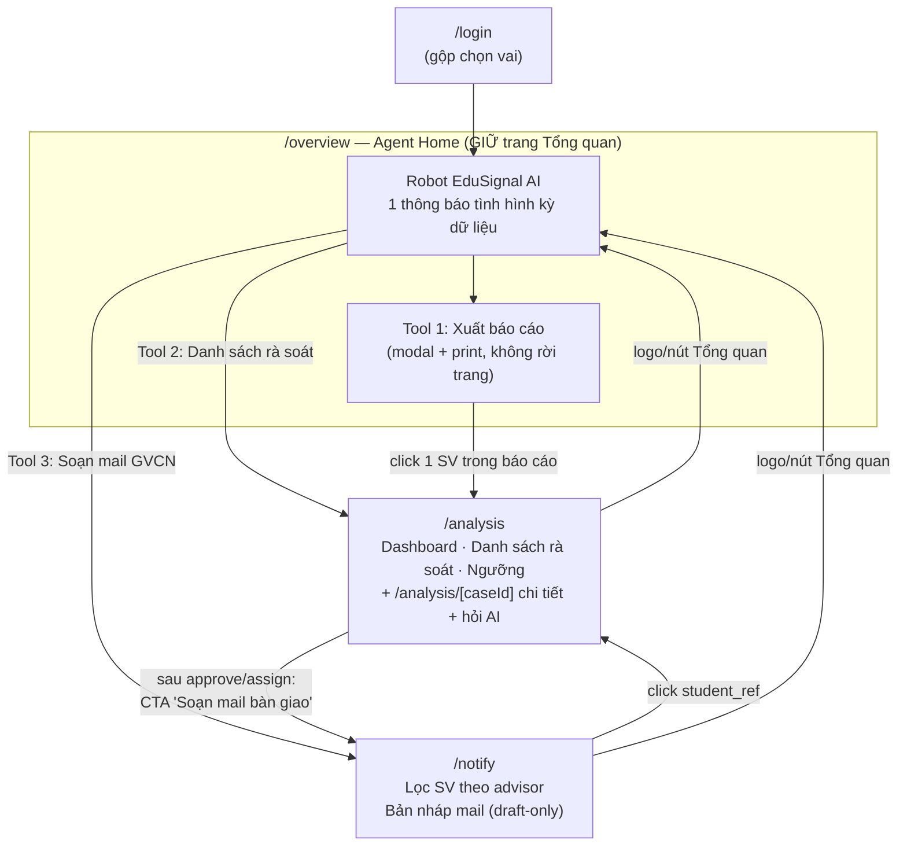

# Plan — Tái cấu trúc FE: 6 page → 4 page, hệ thống "AI agent-first"

> **Trạng thái:** Đề xuất chờ owner FE (Giang) chốt · **Người lập:** AI agent theo yêu cầu Duy (18/7/2026)
> **Nguồn chuẩn:** [RULES.md](RULES.md) · [PRD §5–8](docs/02-product/04-prd.md) · [Process §4](docs/02-product/03-process.md) · [Ethics §3–4/§8](docs/02-product/05-ethics.md) · [H11a contract](docs/04-engineering/10-fe-agent-integration-contract.md) · [FR-12 mail draft](docs/04-engineering/11-advisor-batch-mail-draft.md) · [Agent runtime H23–H26](docs/04-engineering/12-agent-runtime-integration-plan.md) · [Sprint](docs/03-project/03-sprint.md)

## 1. Mục tiêu & concept

Sau khi đăng nhập, **EduSignal AI (robot humanoid)** xuất hiện trên trang Tổng quan và đưa ra **một thông báo duy nhất** về tình hình kỳ dữ liệu vừa rồi (tính từ snapshot `/review-cases` + trạng thái của case-workflow DAG). Người dùng tương tác với agent bằng chuột để rẽ sang 3 tool:

1. **Xuất báo cáo tổng thể** cho Ban quản lý — danh sách toàn bộ sinh viên trong diện cần theo dõi, đánh dấu sinh viên phát hiện mới (in/print tại chỗ, không rời trang Tổng quan).
2. **Phân tích sâu một sinh viên** — điều hướng sang trang Phân tích (dashboard + danh sách + chi tiết case + hỏi AI per-case).
3. **Soạn mail gợi ý cho giảng viên phụ trách** — điều hướng sang trang Thông báo (lọc SV theo advisor, bản nháp mail draft-only).

Hệ quả: rút từ 6 page xuống **4 page**, mọi page nối với nhau qua agent ở Tổng quan làm hub.

### Cơ sở kỹ thuật đã có sẵn (không cần build backend mới)

| Nhu cầu của concept | Backend đã có |
|:--|:--|
| Thông báo tình hình từ snapshot | `GET /review-cases` (state `ok/empty/stale/error`, `calculated_at`, `case_state`, band) — trang Tổng quan hiện tại đã tính rule-based từ đây |
| Báo cáo danh sách SV theo dõi + đánh dấu mới | Cùng `GET /review-cases`; "phát hiện mới" = `case_state = new_signal` |
| Phân tích 1 sinh viên + hỏi AI | `GET /review-cases/{id}` + `POST /review-cases/{id}/explanation` (H24, FR-08 backend Done) |
| Soạn mail cho GVCN | `GET /advisor-handoff-drafts` (H22 **Done**, FR-12) — draft-only, `requires_human_approval=true`, Copy/`mailto:` |
| Duyệt / bàn giao case | `POST /cases/{id}/transitions` (H03) |
| Fairness / ngưỡng | `GET /fairness/report`, `GET /config/thresholds{,/impact}` (H04) |

## 2. Kiến trúc page mới (4 page)

| # | Route | Tên | Vai trò | Nguồn gốc (page cũ được gộp) |
|:-:|:--|:--|:--|:--|
| 1 | `/login` | Đăng nhập | Auth demo + **chọn vai inline** khi tài khoản đa vai | `login` + `select-role` (bỏ route riêng) |
| 2 | `/overview` | **Tổng quan — Agent Home** | Robot + 1 thông báo duy nhất + 3 tool + hỏi nhanh + modal báo cáo | `dashboard?tab=overview` (nâng cấp) |
| 3 | `/analysis` (+ `/analysis/[caseId]`) | Phân tích | Dashboard tinh gọn, danh sách rà soát hợp nhất, ngưỡng; chi tiết case + AgentPanel là sub-route cùng shell. **Vai GVCN dùng chính trang này ở chế độ scoped** | `dashboard?tab=analytics/signals/students/threshold` + `cases/[caseId]` + `my-class` |
| 4 | `/notify` | Thông báo — Soạn mail GVCN | G06/FR-12: bundle theo `advisor_ref`, xem/copy/`mailto:` bản nháp, bucket mapping-repair | **Mới** (task G06 đang mở, backend H22 Done) |

`/` redirect → `/login` (giữ nguyên, không tính là page).

**Mapping 6 → 4:** `select-role` gộp vào `login`; `my-class` + `cases/[caseId]` + các view dashboard gộp vào `analysis`; `signals`/`students` hợp nhất thành `reviews`, bỏ Fairness khỏi navigation; tab `overview` tách thành page `overview` riêng (hub); thêm `notify`.

## 3. Chi tiết từng page

### 3.1 `/login`

- Giữ nguyên form + captcha hiện tại.
- Khi tài khoản có >1 vai: hiển thị **bước chọn vai ngay trong card login** (step 2 của cùng page) thay vì điều hướng `/select-role`. Tài khoản 1 vai → vào thẳng `roleHome(role)`.
- `roleHome`: `ban_quan_ly` → `/overview`; `gvcn` → `/analysis` (chế độ scoped).
- Xoá route `/select-role`, giữ redirect 301 client-side → `/login` để không gãy link cũ.

### 3.2 `/overview` — Agent Home (trang tổng quan, giữ bắt buộc)

Tách tab `overview` của dashboard hiện tại thành page riêng, nâng cấp theo concept:

1. **Một thông báo duy nhất** (thay danh sách findings rời rạc hiện nay): robot + bong bóng chứa 1 đoạn tóm tắt tình hình kỳ dữ liệu, render từ **snapshot live**:
   - Số liệu: tổng tín hiệu, tín hiệu mới (`new_signal`), chờ duyệt (`pending_review`), đang theo dõi/hỗ trợ, số `uu_tien_som`, số case `data_state != ok`.
   - Trạng thái pipeline/DAG: `calculated_at` mới nhất, `dataset_version`/`model_version`, envelope `state` (`stale` → nói rõ "dữ liệu có thể đã cũ"; `error` → fail-closed, robot báo không phân tích được, **không bịa số**).
   - Thông báo là **rule-based tính từ response** (như code hiện tại) — KHÔNG gọi LLM cho bản tóm tắt tổng (H24 chỉ per-case; xem §6 stretch).
2. **3 tool card tương tác chuột** (thay 5 intent card hiện tại):
   - 🗂 **Xuất báo cáo tổng thể** → mở modal báo cáo (dưới).
   - 🔍 **Danh sách rà soát** → `/analysis?tab=reviews`.
   - ✉️ **Soạn mail cho giảng viên phụ trách** → `/notify`.
3. **Modal "Báo cáo tổng thể"** (component mới `ReportModal`):
   - Bảng toàn bộ case đang trong diện theo dõi (mọi `case_state` trừ `dismissed`; `resolved` tách nhóm riêng): `student_ref`, band, state, factor (nhãn VI), coverage/limitations.
   - Cột/badge **"Mới"** cho `case_state = new_signal` (đánh dấu bằng chữ + icon, không chỉ bằng màu).
   - Header báo cáo: kỳ dữ liệu, `calculated_at`, `dataset_version`, `model_version`, dòng cam kết "chỉ gợi ý — con người quyết định".
   - Nút **In / Lưu PDF** = `window.print()` với CSS `@media print` (chỉ in nội dung modal). Không endpoint export mới, không CSV (tránh option C của doc 11).
   - Click 1 dòng → `/analysis/[caseId]`.
   - Copy bắt buộc ghi: *"Danh sách gồm sinh viên có tín hiệu từ nguồn đã duyệt — danh sách toàn bộ sinh viên toàn trường cần API bổ sung (design spec §9)"* — không claim quá dữ liệu đang có.
4. Giữ **AiQuickChat** rule-based hiện có (đã ghi rõ "chưa gọi model AI").

### 3.3 `/analysis` — Phân tích (3 mục + case detail + my-class)

- Chỉ giữ `/analysis?tab=dashboard|reviews|threshold`; link cũ `signals|students` ánh xạ sang `reviews`, link `fairness` về Dashboard.
- **Dashboard tinh gọn:** 3 KPI (ưu tiên sớm, tín hiệu mới, chờ duyệt) + 1 biểu đồ trạng thái. Không bịa delta lịch sử khi API chưa có.
- **Danh sách rà soát:** hợp nhất Tín hiệu/Sinh viên thành một bảng case có tìm kiếm, lọc band/state và sắp xếp; limitations dài chuyển sang chi tiết case.
- Bỏ Fairness khỏi navigation/UI phân tích; backend contract fail-closed hiện có không bị sửa trong task IA này. `ThresholdPanel` giữ nguyên.
- **Chi tiết case** chuyển từ `/cases/[caseId]` → **`/analysis/[caseId]`** và bọc trong `AppShell` (hiện case detail đứng ngoài shell, mất sidebar — sửa luôn khi move). Giữ nguyên: StateTimeline, contributing factors, coverage, `CareActions` (H03), `AgentPanel` (H24 — đây là điểm "hỏi AI về 1 sinh viên" trong concept; lưu ý claim: FR-08 mới Done ở backend, FE Agent UI ship trong plan này phải qua A05 review copy).
- Redirect `/cases/[caseId]` → `/analysis/[caseId]` (giữ deep-link cũ trong docs/evidence).
- **Liên kết sang notify:** trong `CareActions`, sau khi `assign` thành công (case → `assigned`) hiện CTA *"Soạn mail bàn giao cho GVCN →"* trỏ `/notify`. Đây là mắt xích Process bước 9–11.
- **Vai GVCN (thay `my-class`):** cùng page `/analysis`, khi `activeRole = gvcn`:
  - chỉ view "Case của tôi": filter client-side `HANDED_OFF_STATES` như my-class hiện tại (ghi chú gap: production cần scope server-side — giữ nguyên disclaimer Ethics §3 hiện có);
  - ẩn dashboard/ngưỡng toàn đơn vị; ẩn band của case chưa duyệt (đã đúng theo filter state).
  - Sidebar nav render theo vai (AppShell đã hỗ trợ `NAV_BY_ROLE`).

### 3.4 `/notify` — Soạn mail cho GVCN (build mới = task G06, backend đã Done)

Consumer của `GET /advisor-handoff-drafts` (`AdvisorHandoffDraftListResponse`):

- Danh sách **bundle theo `advisor_ref`**: số case, bảng case (`student_ref`, band, factor codes, coverage, `class_code?`).
- **Filter** theo `advisor_ref`, band, factor — đây là "tool filter các sinh viên" trong concept.
- Panel **bản nháp mail**: `draft.subject` + `draft.body` render nguyên văn từ API (FE **không tự viết/sửa lời**), badge cố định *"Bản nháp — cần Ban quản lý duyệt trước khi gửi"* (`requires_human_approval=true` là invariant).
- Hành động: **Copy** (clipboard) và **Mở trong mail client** (`mailto:` không recipient — người dùng tự điền, hệ thống không giữ contact). **Không có nút "Gửi"**, không claim "đã gửi".
- Khu **mapping-repair**: case đã duyệt nhưng thiếu advisor mapping → hiển thị đúng bucket `mapping_repair` + limitations, link về `/analysis/[caseId]`.
- Envelope `empty/error` fail-closed như các trang khác.
- Types mới trong `lib/types.ts` mirror `backend/app/contracts/advisor_handoff_draft.py` (allowlist đóng — `advisor_ref` chỉ được phép trên envelope này, không lan sang trang khác).
- Chỉ vai `ban_quan_ly` truy cập (guard qua AppShell role).

## 4. Ràng buộc bắt buộc giữ nguyên (Ethics/RULES/contract)

1. Không hiển thị raw score/probability/weight ở bất kỳ page/báo cáo nào — chỉ `review_priority_band`.
2. Copy tiếng Việt trung lập: "mức ưu tiên rà soát", "cần theo dõi học vụ"; cấm "nguy cơ bỏ học", "high-risk", chẩn đoán.
3. Fail-closed mọi envelope: `error/empty/stale/insufficient_data` hiển thị đúng trạng thái, không bịa dữ liệu, không FE-fallback band.
4. Agent: chỉ `explain_case`/`neutral_draft`; không transition, không auto-send (refusal `auto_send_or_notify` giữ nguyên); thông báo tuần ở overview là rule-based, không claim LLM.
5. Báo cáo/notify không chứa PII, email/SĐT/tên thật, MSSV; `advisor_ref` chỉ trên trang notify.
6. Không dùng màu làm tín hiệu duy nhất (badge "Mới" phải có chữ/icon).
7. Không claim vượt evidence trong copy: FE Agent UI, danh sách toàn bộ SV, scoping khoa/lớp là gap đã ghi nhận.

## 5. Task breakdown (thứ tự thực hiện)

> Mỗi task ≤ 2–4h, một owner (mặc định lane FE — Giang; Duy hỗ trợ nếu được giao). Verify tối thiểu mỗi task: `npm run lint --prefix frontend` + `npm run build --prefix frontend`; cuối chuỗi chạy `.\scripts\verify.ps1` + smoke UI.

| ID đề xuất | Outcome | Depends | Ghi chú verify/evidence |
|:--|:--|:--|:--|
| **F1 — IA & routing** | `/overview`, `/analysis(+[caseId])`, `/notify` routes + redirect (`/select-role`→`/login`, `/cases/[id]`→`/analysis/[id]`, `/dashboard?tab=…`→route mới); `NAV_BY_ROLE` mới (BQL: Tổng quan · Phân tích · Thông báo; GVCN: Case của tôi); `roleHome` cập nhật | — | Build xanh; click-through mọi nav; deep-link cũ không 404 |
| **F2 — Login gộp chọn vai** | Bước chọn vai inline trong `/login`; xoá page `select-role` | F1 | Smoke: tài khoản 1 vai & đa vai đều vào đúng home |
| **F3 — Overview Agent Home** | 1 thông báo duy nhất (rule-based, đủ nhánh ok/stale/error/empty) + 3 tool card + giữ AiQuickChat | F1 | Copy review theo Ethics §4; mọi số từ response |
| **F4 — ReportModal + print** | Modal báo cáo tổng thể + badge "Mới" + `@media print` + disclaimer phạm vi | F3 | In thử ra PDF; scan không PII/score; click row → case |
| **F5 — Analysis hợp nhất** | 3 mục Dashboard/Reviews/Threshold + case detail trong `/analysis`; GVCN scoped view thay `my-class`; xoá `my-class`, `cases/` | F1 | Smoke link cũ/mới ở cả 2 vai; CareActions/AgentPanel/Threshold hoạt động như cũ; diff không đổi hành vi API |
| **F6 — Notify (G06)** | Types mirror H22 + fetch client + page notify đầy đủ (bundle/filter/draft/copy/mailto/mapping-repair/empty/error) | F1 | Không auto-send; `requires_human_approval` luôn hiển thị; fixture H22 làm test data; **đây chính là task G06 trong sprint — làm ở đây thì tick G06** |
| **F7 — Cross-link workflow** | CTA assign→notify; notify→case detail; report→case detail; overview→analysis?q= | F4,F5,F6 | Click-through toàn vòng: login→overview→report→case→approve→assign→notify→copy draft |
| **F8 — Gate & handoff** | `.\scripts\verify.ps1`, `git diff --check`, smoke Live URL, cập nhật Sprint board (G06 + task mới), ghi gaps | F1–F7 | Handoff format theo AGENTS §E; ghi rõ `npm test` FE vẫn placeholder |

**Ước lượng tổng:** ~12–16h dev FE, chia được 2 người (F3/F4 song song F5; F6 độc lập sau F1).

## 6. Quyết định cần owner chốt trước khi build

| # | Câu hỏi | Khuyến nghị |
|:-:|:--|:--|
| 1 | Threshold giữ ở đâu khi còn 4 page? | Giữ nguyên tab Ngưỡng trong `/analysis`; bỏ Fairness khỏi navigation/UI theo quyết định mới nhất của owner. |
| 2 | GVCN dùng `/analysis` scoped thay `my-class`? | Đồng ý — cùng shell, filter `HANDED_OFF_STATES` như cũ, giữ disclaimer Ethics §3 |
| 3 | Thông báo tuần của robot có gọi LLM không? | **MVP: rule-based** (không cần backend mới, không rủi ro claim). Stretch sau submission: endpoint `GET /overview-briefing` dùng cùng guardrail H25 — cần decision + task backend riêng, KHÔNG tự build |
| 4 | Báo cáo xuất dạng gì? | Print-to-PDF client-side (option A tinh thần doc 11). Không CSV/không endpoint export (tránh lộ PII khi join ngoài) |
| 5 | "Tuần vừa rồi" trong thông báo | Dữ liệu chỉ có `calculated_at` snapshot, chưa có API lịch sử theo tuần → copy dùng "kỳ dữ liệu này", không claim so sánh tuần trước (đúng nguyên tắc hiện tại của dashboard) |

## 7. Rủi ro & gap đã biết

- `npm test --prefix frontend` là placeholder → evidence hành vi = smoke thủ công + build; ghi rõ trong handoff (AGENTS §4).
- `ReviewCase` public thiếu `cohort/department/class_code` → filter lớp/khoa ở analysis & notify bị giới hạn (notify có `class_code?` riêng từ H22); không tự thêm field — cần Hoàng nếu muốn mở rộng H11a.
- FE Agent UI (AgentPanel) ship trong redesign phải qua A05 claim-copy review trước D4r; slide/video chỉ claim đúng mức.
- Không có danh sách "toàn bộ sinh viên" toàn trường (chỉ SV có tín hiệu) — báo cáo phải ghi chú phạm vi.
- Redirect route cũ cần giữ ít nhất tới sau submission (docs/evidence đang link `/dashboard`, `/cases/...`).
- Branch hiện tại `TruongGiang` đang có diff FE chưa commit (dashboard/login/AppShell/session) — F1–F5 phải rebase trên diff này, không ghi đè.
